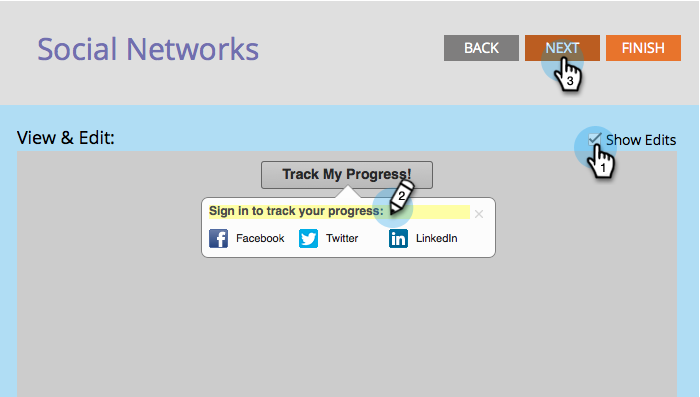

# Configurer le flux de progression du suivi pour une Offre de référence {#configure-track-progress-flow-for-a-referral-offer}

Lorsque vous [créez une offre](../../../../product-docs/demand-generation/social/referral-offers/create-a-referral-offer.md)de référence, vous pouvez configurer les invites qui montrent aux participants leur progression vers la récompense.

1. Accédez à Activités **** marketing.

   

1. Sélectionnez l’offre de référence, puis cliquez sur **Modifier le brouillon**.

   

1. Dans l’éditeur d’offres de référence, accédez à **Suivi du flux** de progression > Réseaux **** sociaux.

   

1. Dans la fenêtre **Vue** **&amp;** **Modifier** , modifiez l’invite qui demande aux participants de se connecter au même réseau social qu’avant pour s’inscrire à votre offre.

   

   >[!NOTE]
   >
   >Pour mettre en surbrillance le texte que vous pouvez modifier, sélectionnez **Afficher les modifications** dans le coin supérieur droit.

1. Modifiez l’invite qui encourage le participant à partager le lien avec d’autres amis.

   

1. Modifiez l’invite qui informe le participant qu’il a atteint l’objectif d’exécution et qu’il doit vérifier son courrier électronique.

   

1. Modifiez le message qui informe un participant qui réussit des codes promotionnels appropriés pour récupérer sa récompense.

   

>[!NOTE]
>
>**Articles connexes**
>
>Cliquez ensuite sur **Terminer > Approuver et fermer** et [publier votre offre](../../../../product-docs/demand-generation/social/referral-offers/publish-a-referral-offer.md)de référence.

