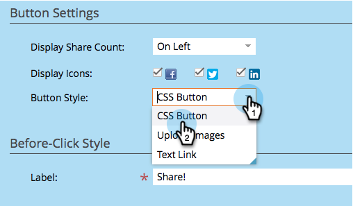

# Bouton Personnaliser l’application sociale {#customize-social-app-button}

Lorsque vous créez un [bouton social](/help/marketo/product-docs/demand-generation/landing-pages/free-form-landing-pages/add-a-social-button-to-a-free-form-landing-page.md) ou une [offre de référence](/help/marketo/product-docs/demand-generation/social/referral-offers/create-a-referral-offer.md), vous pouvez personnaliser l’aspect des boutons.

>[!IMPORTANT]
>
>Le 31 juillet 2024, nous avons commencé à abandonner cette fonctionnalité. Vous ne pourrez pas créer de nouvelles ressources. Les ressources existantes continueront à fonctionner jusqu’au 31 janvier 2025. [En savoir plus](https://nation.marketo.com/t5/employee-blogs/marketo-engage-social-features-deprecation/ba-p/351977){target="_blank"}

1. Accédez à **Activités marketing**.

   

1. Sélectionnez l’application et cliquez sur **Modifier le brouillon**.

   

1. Dans l’éditeur d’applications sociales, accédez à **Paramètres de l’application** > **Style de bouton** (ou **Style d’inscription,** pour les offres de parrainage).

   

1. Choisissez où afficher le nombre de partages ou non.

   

1. Sélectionnez les icônes de réseau social à afficher avec les boutons correspondants.

   

   >[!NOTE]
   >
   >Pour les offres de parrainage, sélectionnez vos réseaux sous **2. Flux d’inscription > Réseaux sociaux**.

1. Choisissez un type de bouton.

   

   >[!TIP]
   >
   >Si vous avez sélectionné **Télécharger des images sous le style de bouton** ci-dessus, les sections suivantes vous permettent de télécharger des images de bouton au lieu de modifier le texte.

1. Modifiez les libellés du bouton, avant et après avoir cliqué.

   

1. À chaque choix, passez en revue le résultat dans la fenêtre **Afficher et modifier**.

   

>[!NOTE]
>
>Dans une offre de référence, vous pouvez également personnaliser le bouton **Track Progress** (Suivre la progression). Accédez à **Paramètres de l’application** > **Suivi du style de progression** et procédez comme indiqué ci-dessus.

>[!MORELIKETHIS]
>
>Pour un bouton social, [configurez à l’ouverture](/help/marketo/product-docs/demand-generation/social/configuring-social-actions/configure-when-social-button-opens.md). Pour une offre de référence, [ spécifiez l’objectif de l’offre ](/help/marketo/product-docs/demand-generation/social/referral-offers/specify-goal-for-referral-offer.md).
