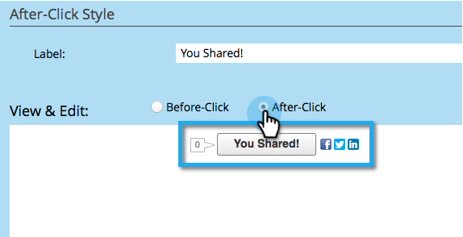

# Personnaliser le bouton de l’application Social {#customize-social-app-button}

Lorsque vous créez un [bouton social](../../../../product-docs/demand-generation/landing-pages/free-form-landing-pages/add-a-social-button-to-a-free-form-landing-page.md) ou une [offre de référence](../../../../product-docs/demand-generation/social/referral-offers/create-a-referral-offer.md), vous pouvez personnaliser l’aspect des boutons.

1. Accédez à **Activités marketing**.

   

1. Sélectionnez l’application, puis cliquez sur **Modifier le brouillon.**

   

1. Dans l’éditeur d’applications sociales, accédez à **Paramètres de l’application** > **Style de bouton** (ou **Style d’inscription,** pour les offres de référence).

   

1. Choisissez où afficher le nombre de partages ou non pour l’afficher.

   

1. Sélectionnez les icônes de réseau social à afficher avec leurs boutons correspondants.

   

   >[!NOTE]
   >
   >Pour les offres de référence, sélectionnez vos réseaux sous **2. Flux d’inscription > Réseaux sociaux**.

1. Choisissez un type de bouton.

   

   >[!TIP]
   >
   >Si vous avez choisi **Télécharger les images sous Style de bouton** ci-dessus, les sections suivantes vous permettent de télécharger des images de bouton au lieu de modifier le texte.

1. Modifiez les libellés du bouton, avant et après avoir cliqué.

   

1. Lorsque vous faites chaque choix, passez en revue le résultat dans la fenêtre **Vue et modification**.

   

>[!NOTE]
>
>Dans une offre de référence, vous pouvez également personnaliser le bouton **Suivi de la progression**. Accédez à **Paramètres de l’application** > **Suivi du style de progression** et suivez les mêmes étapes que ci-dessus.

>[!MORELIKETHIS]
>
>Pour un bouton social, [configurez quand il s’ouvre](configure-when-social-button-opens.md). Pour une offre de référence, [spécifiez l&#39;objectif d&#39;offre](../../../../product-docs/demand-generation/social/referral-offers/specify-goal-for-referral-offer.md).

