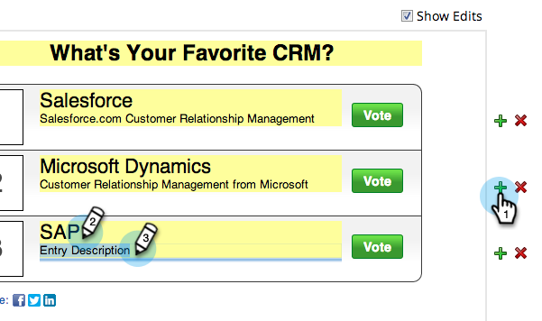

# Créer un sondage {#create-a-poll}

Interagir avec les gens avec un sondage dans lequel ils peuvent voter et partager avec leurs amis sur les réseaux sociaux. Vous pouvez l’ajouter à des endroits tels que vos landings page, votre site Web et Facebook.

>[!NOTE]
>
>**Disponibilité**
>
>Tous les clients n’ont pas acheté cette fonctionnalité. Contactez votre représentant commercial pour plus de détails.

>[!NOTE]
>
>**Conditions préalables**
>
>Si vous souhaitez utiliser des images dans votre sondage, ajoutez-les à votre bibliothèque d’images et de fichiers marketing avant de commencer. Ajoutez une image de 60 x 60 pixels pour chaque entrée d’interrogation. Voir [Ajouter des images et des fichiers au marketing](../../../../product-docs/demand-generation/images-and-files/add-images-and-files-to-marketo.md).

1. Dans votre programme, sélectionnez **Nouveau** > **Nouveau fichier local.**

   

1. Dans la Galerie de ressources **locales,** cliquez sur **Sondage.**

   

1. Nommez votre sondage.

   

   >[!TIP]
   >
   >Pour gagner du temps, vous pouvez utiliser l’option **Cloner à partir** pour copier tous les paramètres d’un partage de vidéo existant.

1. Faites un gros titre à votre sondage (habituellement une brève question).

   

1. Pour chaque entrée, modifiez le titre et la description.

   

1. Pour ajouter une entrée, cliquez sur le symbole **+** et modifiez le titre et la description.

   

1. Pour chaque entrée, vous pouvez ajouter une image en cliquant sur la miniature numérotée.

   

1. Sélectionnez l’image dont vous avez besoin, puis cliquez sur **Sélectionner.**

   

1. Après avoir défini la miniature, le titre et la description de toutes les entrées, cliquez sur **Terminer.**

   

1. Cliquez sur **Approuver** et **Fermer.**

   

L’éditeur de sondage s’ouvre dans une nouvelle fenêtre. Les paramètres par défaut sont corrects, mais vous devez quand même ajouter vos entrées de sondage. Nous vous montrerons comment dans les prochaines étapes.

>[!TIP]
>
>Pour modifier l’un des paramètres par défaut de votre sondage, cliquez sur **Précédent**. Pour enregistrer votre travail pour plus tard sans approbation, cliquez sur **Fermer**.

S’il y a des problèmes dans le sondage, vous serez invité à les résoudre avant que le sondage ne soit approuvé. Félicitations ! Vous avez créé votre sondage.

>[!NOTE]
>
>**Articles connexes**
>
>L’étape suivante consiste à [publier votre sondage](publish-a-poll.md), mais vous pouvez modifier les paramètres de votre sondage si nécessaire. Début avec [personnalisation des paramètres](customize-poll-settings.md)du sondage.

