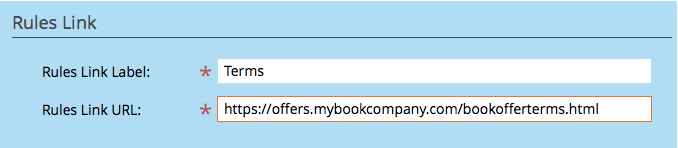

# Créer une Offre de référence {#create-a-referral-offer}

Les offres de renvoi incitent les gens à se tourner vers leurs amis. Créez des objectifs et des récompenses pour les renvois réussis. Vous pouvez le déposer sur les landings page, votre site Web et même Facebook.

>[!NOTE]
>
>**Disponibilité**
>
>Tous les clients n’ont pas acheté cette fonctionnalité. Contactez votre représentant commercial pour plus de détails.

1. Dans votre programme, sélectionnez **New** > **New Local Asset.**

   

1. Dans la **Galerie locale des ressources,** cliquez sur **Offre de référence.**

   

1. Nommez votre offre de référence.

   

   >[!TIP]
   >
   >Pour gagner du temps, vous pouvez utiliser l&#39;option **Cloner à partir de** pour copier tous les paramètres d&#39;une offre de référence existante.

   L&#39;éditeur d&#39;offres de référence s&#39;ouvre dans une nouvelle fenêtre. Les paramètres par défaut sont tous bons, mais vous devez ajouter un lien vers les règles de votre offre (termes et conditions). Le lien s’affiche dans la partie inférieure des écrans de message de partage. Nous vous montrerons comment procéder à l’étape suivante.

1. Cliquez sur **Options avancées.**

   

1. Ajoutez un lien vers les règles de votre offre. Entrez l&#39;**URL.**

   

   >[!NOTE]
   >
   >Dans cet écran, vous pouvez également ajouter un lien vers la politique de confidentialité. Voir [Ajouter votre politique de confidentialité à une application Social](../../../../product-docs/demand-generation/social/social-functions/add-your-privacy-policy-to-a-social-app.md).

1. Cliquez sur **Terminer.**

   

1. Cliquez sur **Approuver** **et** **Fermer.**

   >[!TIP]
   >
   >Pour modifier les valeurs par défaut de votre offre de référence, cliquez sur **Précédent**. Pour enregistrer votre travail pour plus tard sans approbation, cliquez sur **Fermer.**

   

S&#39;il y a des problèmes dans l&#39;offre de renvoi, vous serez invité à les résoudre avant que l&#39;offre ne soit approuvée.

Félicitations ! Vous avez créé votre offre de référence.

>[!MORELIKETHIS]
>
>L’étape suivante consiste à [publier votre offre de référence](publish-a-referral-offer.md) sur un landing page, sur votre site Web ou sur Facebook.

>[!NOTE]
>
>**Plongée profonde**
>
>Tous les paramètres, chaînes et messages par défaut peuvent être modifiés.

