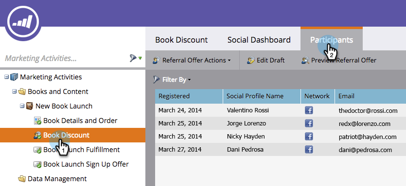

# Envoyer un courriel d&#39;exécution d&#39;Offre de référence {#send-referral-offer-fulfillment-email}

Récompensez vos clients avec des coupons et des codes de remise à l&#39;aide du courriel d&#39;exécution d&#39;offre.

>[!PREREQUISITES]
>
>* [Utiliser des courriers électroniques dans les promotions sociales](/help/marketo/product-docs/demand-generation/social/social-functions/use-emails-in-social-promotions.md)
>* [Créer une Offre de référence](/help/marketo/product-docs/demand-generation/social/referral-offers/create-a-referral-offer.md)

## Configurer la Diffusion d&#39;exécution {#set-up-fulfillment-delivery}

1. Sélectionnez l’offre de référence. Cliquez sur **Modifier le brouillon**.

   

1. Sous **Paramètres de l’application**, sélectionnez **Détails de l’Offre**.

   

1. Sélectionnez un **courriel d&#39;inscription**.

   

1. Sélectionnez un **courriel d&#39;exécution**.

   

   >[!NOTE]
   >
   >En savoir plus sur [l’utilisation des courriers électroniques dans les promotions sociales](/help/marketo/product-docs/demand-generation/social/social-functions/use-emails-in-social-promotions.md).

1. Cliquez sur la liste déroulante **Diffusion d’exécution** et sélectionnez **auto sur l’objectif**.

   

   Le message sélectionné dans **Courriel d’exécution** sera automatiquement envoyé aux personnes qui atteignent l’objectif.

## Envoi manuel {#manual-send}

Vous pouvez envoyer manuellement un courrier électronique d’exécution à une personne une fois qu’elle a atteint l’objectif.

1. Sélectionnez l’offre de référence et cliquez sur l’onglet **Participants**.

   

1. Cliquez sur l&#39;option **Filtrer par** et sélectionnez **Objectif**.

   >[!NOTE]
   >
   >Cette option sélectionne les personnes qui ont atteint l’objectif de l’offre de référence.

   

1. Sélectionnez les personnes dans la vue filtrée.

   

1. Cliquez avec le bouton droit de la souris et sélectionnez **Envoyer un courriel d’exécution**.

   

Super ! Ces personnes recevront désormais un courriel d&#39;exécution et seront séduites par leur récompense.
