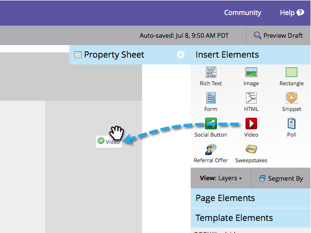

# Ajouter une vidéo {#add-a-video}

Placez des vidéos avec des options de partage sur vos landings page.

>[!AVAILABILITY]
>
>Tous les clients n’ont pas acheté cette fonctionnalité. Contactez votre représentant commercial pour plus de détails.

1. Accédez à votre landing page et cliquez sur **Modifier le brouillon**.

   

1. Faites glisser **Vidéo** depuis les éléments de droite.

   

1. Sélectionnez **Créer** dans la liste déroulante.

   

   >[!NOTE]
   >
   >Vous pouvez également créer un partage de vidéo _dans un programme_ en sélectionnant **New** > **New Local Asset**. Vous pouvez ensuite la sélectionner dans la liste déroulante, comme illustré ici.

1. Entrez l’URL de la vidéo YouTube et nommez votre partage de vidéo. Sous l&#39;option **Cloner à partir de** sélectionnez **Aucun** et cliquez sur **Insérer**.

   

>[!TIP]
>
>Pour gagner du temps, vous pouvez utiliser l’option **Cloner à partir de** pour copier tous les paramètres d’un partage de vidéo existant.

Félicitations ! Vous avez ajouté un partage de vidéos à votre landing page. Approuvez le landing page et votre partage vidéo est en direct. Vous pouvez également [publier le landing page sur Facebook](/help/marketo/product-docs/demand-generation/facebook/publish-landing-pages-to-facebook.md) ou [placer le partage de vidéo sur votre site Web](/help/marketo/product-docs/demand-generation/social/configuring-social-actions/customize-video-share-flow.md).

>[!MORELIKETHIS]
>
>Vous avez terminé, mais vous pouvez modifier les paramètres de votre partage de vidéos si nécessaire. Début avec [personnalisation du flux de partage](/help/marketo/product-docs/demand-generation/social/configuring-social-actions/customize-video-share-flow.md) (quand et où l’invite de partage s’ouvre).
