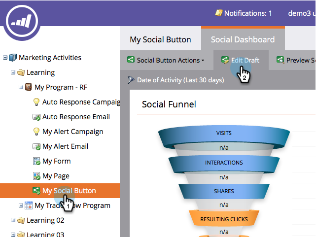
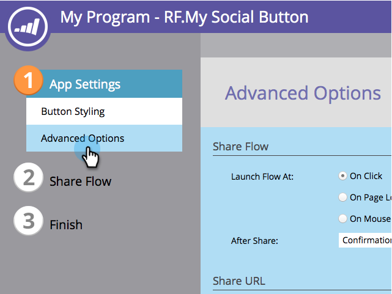
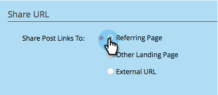

# Sélectionnez l’URL de partage pour une application sociale {#choose-the-share-url-for-a-social-app}

Lorsque vous créez une application sociale, vous pouvez choisir l’URL qui sera partagée dans les publications des participants.

1. Accédez à **Activités marketing**.

   

1. Sélectionnez l’application, puis cliquez sur **Modifier le brouillon**.

   

1. Dans l’éditeur d’applications sociales, accédez à **Paramètres de l’application**, puis à **Options avancées**.

   

1. Sélectionnez l’URL à laquelle les liens des publications sociales pointent.

   

   >[!NOTE]
   >
   >**Définition**
   >
   >Le lien Partager les publications peut renvoyer à trois emplacements :
   >
   >* **Page** référente : Page contenant l’application.
   >* **Autre Landing page** : Un landing page Marketo différent de celui de la liste déroulante.
   >* **URL** externe : Landing page non marchand.

>[!MORELIKETHIS]
>
>[Ajouter votre politique de confidentialité à une application Social](/help/marketo/product-docs/demand-generation/social/social-functions/add-your-privacy-policy-to-a-social-app.md)
