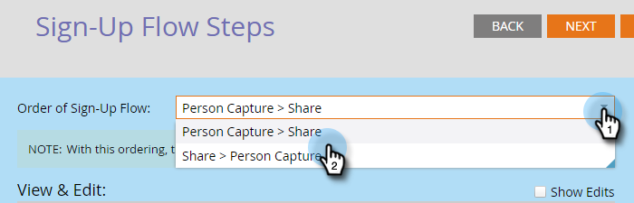

# Définition des besoins en partage sur les réseaux sociaux {#set-social-share-requirement}

Lorsque vous [créez une offre](../../../../product-docs/demand-generation/social/referral-offers/create-a-referral-offer.md)de référence, vous pouvez demander à des personnes de partager l’offre pour s’inscrire ou la rendre facultative.

>[!NOTE]
>
>**FYI**
>
>Marketo est maintenant en train de normaliser la langue dans tous les abonnements. Vous pouvez donc voir des pistes dans votre abonnement et des personnes/personnes dans docs.marketo.com. Ces termes signifient la même chose ; cela n&#39;a aucune incidence sur les instructions relatives aux articles. Il y a aussi d&#39;autres changements. [En savoir plus](http://docs.marketo.com/display/DOCS/Updates+to+Marketo+Terminology).

1. Accédez à Activités **** marketing.

   

1. Sélectionnez l’offre de référence, puis cliquez sur **Modifier le brouillon**.

   

1. Dans l’éditeur d’offres de référence, accédez aux Paramètres **de l’** application, puis aux Étapes **de flux d’** inscription.

   

1. Sélectionnez l&#39;ordre du flux d&#39;inscription.

   

   * **Capture de la personne > Partager**: Une personne peut ignorer le partage et simplement s&#39;inscrire.
   * **Partager > Capture** de personne : La personne doit partager pour s&#39;inscrire.

1. Pour chaque option, voir la prévisualisation dans la fenêtre **Vue et modification** .

   

