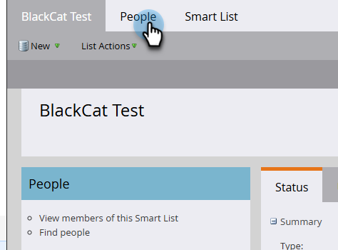
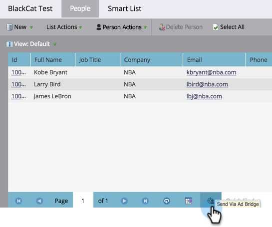

# Utiliser une liste Marketo ou une liste dynamique comme segment d’audience LinkedIn {#use-a-marketo-list-or-smart-list-as-a-linkedin-audience-segment}

Intégrez vos utilisateurs Marketo Engage à vos audiences LinkedIn.

>[!PREREQUISITES]
>
>[Ajout d’audiences correspondantes LinkedIn en tant que service LaunchPoint](/help/marketo/product-docs/demand-generation/ad-network-integrations/add-linkedin-matched-audiences-as-a-launchpoint-service.md){target="_blank"}

1. Accédez à la **[!UICONTROL Base de données]**.

   

1. Sélectionnez une liste dynamique.

   

1. Cliquez sur l’onglet **[!UICONTROL Personnes]**.

   

1. Cliquez sur l’icône _Envoyer via Ad Bridge_  au bas de la liste.

   

   >[!NOTE]
   >
   >Lors de l’utilisation d’intégrations de réseau publicitaire pour envoyer une audience à LinkedIn, Marketo envoie uniquement l’adresse e-mail.

1. Sélectionnez **[!UICONTROL LinkedIn]** et cliquez sur **[!UICONTROL Suivant]**.

   

1. Sélectionnez une _audience LinkedIn_.

   >[!NOTE]
   >
   >Cliquez sur **[!UICONTROL +Nouvelle audience]** pour créer une audience dans LinkedIn Campaign Manager.

   

   >[!NOTE]
   >
   >LinkedIn a abandonné les API utilisées pour le type de notification push « Effacer l’audience et ajouter des prospects » en mars 2018. Cette option n’est plus disponible à compter de la version de Marketo du 1er trimestre 2018.

1. Sélectionnez un _[!UICONTROL type push]_. Cliquez sur **[!UICONTROL Mettre à jour]**.

   

   >[!NOTE]
   >
   >Patientez 15 minutes pour que la synchronisation ait lieu.

Cinq ans ! Vos données vont désormais correspondre aux audiences de LinkedIn. Pour plus d’informations sur le téléchargement de listes vers LinkedIn pour le ciblage des comptes et des contacts, consultez [Centre d’aide des solutions marketing de LinkedIn](https://www.linkedin.com/help/lms/answer/73938?query=ad%20segment){target="_blank"}.
