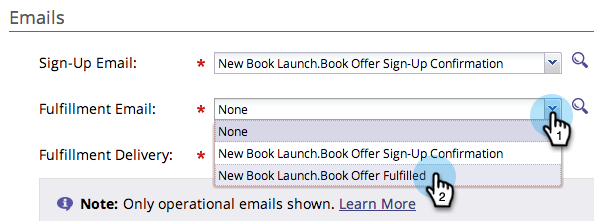
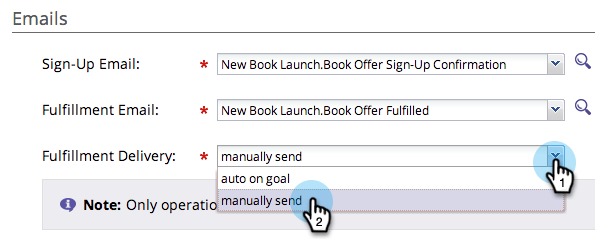

# Utiliser des courriers électroniques dans les promotions sociales {#use-emails-in-social-promotions}

Lorsque vous créez une offre [de](../../../../product-docs/demand-generation/social/referral-offers/create-a-referral-offer.md) référence ou un tirage , vous pouvez inclure des courriels à envoyer lorsque la personne s&#39;inscrit, et à nouveau lorsque la personne a gagné la récompense.

>[!TIP]
>
>Pour créer un courrier électronique, voir [Envoyer un message électronique](../../../../getting-started/quick-wins/send-an-email.md).

Dans les courriels, utilisez les jetons suivants :

* **Courriel** d&#39;inscription : Servez-vous **`{{social.Share Url}}`** pour envoyer à chaque participant un lien de partage personnalisé.

* **Adresse électronique** d’exécution : Utilisez **`{{social.Promo Code}}`** pour envoyer à chaque gagnant un code [de](use-promo-codes-for-offer-fulfillment.md)promotion.

>[!NOTE]
>
>**Conditions préalables**
>
>Avant de pouvoir ajouter un courrier électronique à une application sociale, il doit être *opérationnel* et *approuvé*. Voir [Modifier les paramètres d’un courrier électronique](../../../../product-docs/email-marketing/general/functions-in-the-editor/make-an-email-operational.md).

1. Accédez à Activités **** marketing.

   

1. Sélectionnez l’application, puis cliquez sur **Modifier le brouillon**.

   

1. Dans l’éditeur d’applications sociales, accédez à Paramètres de l’ **application > Détails** de l’Offre (ou Détails **des** tirages).

   

1. Ajoutez le courrier électronique d’inscription.

   

   >[!NOTE]
   >
   >L&#39;e-mail de confirmation est envoyé automatiquement lorsqu&#39;une personne s&#39;inscrit.

1. Ajoutez le courrier électronique d’exécution.

   

1. Dans une offre de référence, choisissez si le courrier électronique d’exécution est envoyé automatiquement ou manuellement.

   

>[!NOTE]
>
>Dans le cadre d’un tirage, le courrier électronique d’exécution est toujours envoyé automatiquement lorsque vous [sélectionnez le gagnant](../../../../product-docs/demand-generation/social/sweepstakes/select-sweepstakes-winners.md).

>[!NOTE]
>
>**Définition**
>
>* **auto sur objectif**: Le courrier électronique d’exécution est envoyé automatiquement lorsque chaque participant atteint l’objectif.
>* **envoi** manuel : Une fois que les personnes ont début d’atteindre l’objectif, retournez à votre offre de référence pour [envoyer manuellement le courrier électronique](../../../../product-docs/demand-generation/social/referral-offers/send-referral-offer-fulfillment-email.md)d’exécution.

>

>[!NOTE]
>
>**Articles connexes**
>
>Ensuite, vous pouvez [choisir l’URL](choose-the-share-url-for-a-social-app.md) de partage ou, dans votre offre de référence, vous pouvez [télécharger les codes](use-promo-codes-for-offer-fulfillment.md) promotionnels que vous allez envoyer.

