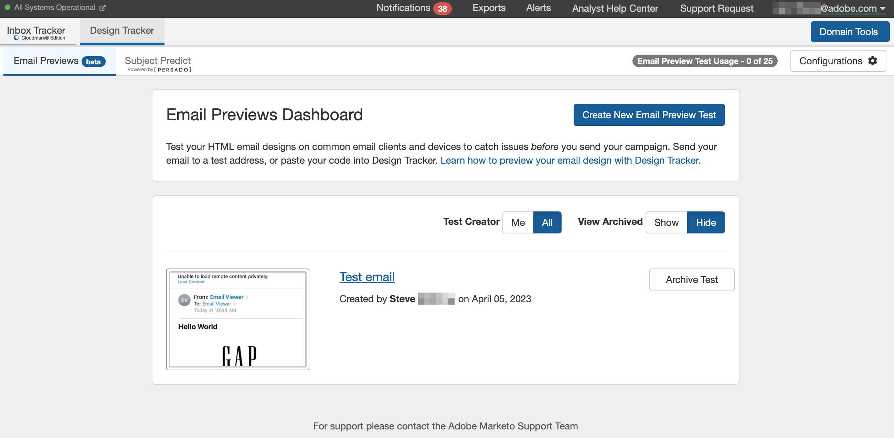

# Tutoriels sur le dispositif de suivi de la boîte de réception {#inbox-tracker-tutorials}

Testez, surveillez et comprenez les problèmes de délivrabilité grâce aux outils de délivrabilité des e-mails optimisés par la plateforme de suivi de la boîte de réception de Bird (anciennement MessageBird). Le dispositif de suivi de la boîte de réception est une application unique qui combine l’intelligence de votre programme et la prévision du rendu des e-mails/des tests de boîte de réception pour optimiser les performances de vos e-mails.

>[!AVAILABILITY]
>
>Tous les utilisateurs de Marketo Engage n’ont pas acheté cette fonctionnalité. Pour plus d’informations, contactez l’équipe du compte Adobe (votre gestionnaire de compte).

Bird a créé plusieurs vidéos de formation pour vous aider à tirer le meilleur parti de cet outil puissant.

## Présentation du dispositif de suivi de la boîte de réception {#inbox-tracker-overview}

* [Navigation de base](https://veed.io/view/263a0e5e-3b0c-40a4-98a7-945fe28173a1){target="_blank"}

* [Paramètres des utilisateurs et des comptes](https://veed.io/view/dae8007a-89b4-4a2a-b666-0e9b12706866){target="_blank"}

* [Intelliseed (configurer et télécharger)](https://veed.io/view/8b9e398e-21c9-49dc-a133-e1d8eb8ba03d){target="_blank"}

## Section Délivrabilité Du Dispositif De Suivi De La Boîte De Réception {#inbox-tracker-deliverability-section}

* [Présentation du tableau de bord](https://veed.io/view/2d1084f3-b4b4-440b-9977-a3cc3b885bb9){target="_blank"}

* [Tableau de bord (délivrabilité)](https://veed.io/view/f5dc2e22-3ed1-4024-b6c5-bf346adcc07d){target="_blank"}

* [Tableau de bord (réputation et authentification)](https://veed.io/view/ec237f9d-7923-4ddc-8a58-15d58774d382){target="_blank"}

* [Pondération du FAI](https://veed.io/view/bec80e1d-66f2-462c-8470-60610c8a07f7){target="_blank"}

* [Alertes](https://veed.io/view/1d968a33-e565-4cd2-b25f-53cca61b4823){target="_blank"}

* [Présentation du dispositif de suivi de Campaign](https://veed.io/view/8c92bdc5-4131-498c-a450-a518f2e91b17){target="_blank"}

* [Suivi De Campagne (Révision De Campagne)](https://veed.io/view/9c8e18a4-5d9e-495c-ad92-83309f40314a){target="_blank"}

* [Analytics Tracker](https://veed.io/view/b458f788-07e1-4553-b743-2d469a356ba2){target="_blank"}

* [Moniteur de profil](https://veed.io/view/6ca38d3f-df46-4707-a6cb-dde0fbad470b){target="_blank"}

* [Moniteur de piège à spam](https://veed.io/view/ce488da2-1688-4584-9c26-27baa9c8ed19){target="_blank"}

## Protection de la marque du dispositif de suivi de la boîte de réception {#inbox-tracker-brand-protection}

* [Tableau de bord](https://veed.io/view/287b425f-2ec8-470b-b993-a654b92b759d){target="_blank"}

* [Détails du domaine](https://veed.io/view/cb8a4f53-8008-483b-841a-b0878b8bf17b){target="_blank"}

* [Gestionnaire de politiques](https://veed.io/view/1036967c-0f77-4fd6-8c40-71553bceef3d){target="_blank"}

## Outils De Postmaster Du Dispositif De Suivi De La Boîte De Réception {#inbox-tracker-postmaster-tools}

* [Outils Google Postmaster](https://veed.io/view/7c89c0d8-ead2-46ad-9709-7509d043442a){target="_blank"}

## Suivi de conception {#design-tracker}

* [Suivi de conception](https://veed.io/view/3efe7959-d835-4a00-948c-93e4a0394871){target="_blank"}
