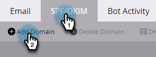
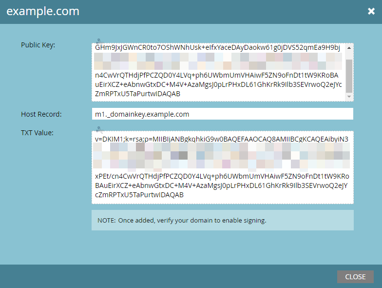

# Configurer une signature DKIM personnalisée {#set-up-a-custom-dkim-signature}

Pour garantir une délivrabilité optimale, Marketo signe automatiquement tous les e-mails sortants avec une signature DKIM partagée.

>[!NOTE]
>
>Vous aurez peut-être besoin de l’aide de votre équipe informatique pour suivre certaines des étapes décrites dans cet article.

Vous pouvez personnaliser la signature DKIM pour refléter le ou les domaines de votre choix.

1. Accédez à la section **[!UICONTROL Admin]**.

   

   >[!NOTE]
   >
   >Si vous configurez une signature DKIM personnalisée à l’aide de la méthode héritée, elle continuera à fonctionner et devrait s’afficher ici.

1. Cliquez sur **E-mail**.

   

1. Cliquez sur l’onglet **SPF/DKIM**, puis **Ajouter un domaine**.

   

1. Saisissez le domaine que vous utiliserez dans les e-mails Marketo comme adresse d’expédition. Choisissez un sélecteur et une taille de clé. Cliquez sur **Ajouter** lorsque vous avez terminé.

   

   <table>
   <tr>
   <td width="20%"><b>Sélecteur</b></td>
   <td>Chaîne/identifiant unique utilisé pour localiser la partie clé publique de l’enregistrement DKIM. Il peut s’agir d’une chaîne arbitraire ou d’un identifiant unique permettant de séparer et d’identifier l’objectif de cette clé/de cet enregistrement DKIM.</td>
   </tr>
   <tr>
   <td width="20%"><b>Longueur de clé</b></td>
   <td>Niveau de sécurité avec lequel vous souhaitez que votre signature DKIM soit chiffrée.</td>
   </tr>
   </tbody>
   </table>

   

   >[!TIP]
   >
   >* Une taille de clé de 2048 est recommandée.
   >* Si vous utilisez un autre domaine dans votre adresse d’expédition, Marketo utilisera la signature DKIM partagée.

   >[!IMPORTANT]
   >
   >Si vous devez mettre à jour le sélecteur DKIM ou la taille de chiffrement DKIM pour votre domaine, vous devez supprimer l’enregistrement existant et republier l’enregistrement nouvellement généré avec les nouvelles valeurs.
   >
   >Dans ce cas, DKIM ne sera pas signé pour votre domaine tant que votre nouvel enregistrement n’aura pas été publié et validé par notre système. Planifiez votre modification en conséquence, car il peut s’écouler entre 24 et 48 heures avant que le nouvel enregistrement DKIM ne soit complètement propagé sur Internet.

1. Envoyez les **[!UICONTROL enregistrement hôte]** et **[!UICONTROL valeur TXT]** à votre service informatique. Demandez-leur de créer l’enregistrement pour vous et assurez-vous qu’il se propage à tous les serveurs de noms associés au domaine de l’expéditeur. La vérification du DKIM Marketo nécessite que la clé DKIM soit propagée à tous les serveurs de noms associés au domaine signé par DKIM.

   

1. Après avoir confirmé la création de l’enregistrement, revenez à Marketo, sélectionnez votre domaine et cliquez sur **[!UICONTROL Vérifier le DNS]**.

   

   >[!NOTE]
   >
   >Si la confirmation échoue et que votre service informatique a créé l’enregistrement correctement, cela peut être une question de propagation DNS. Veuillez réessayer ultérieurement.

   >[!CAUTION]
   >
   >La modification/suppression de l’enregistrement DNS correspondant aura une incidence négative sur la délivrabilité. Supprimez l’entrée dans Marketo avant d’apporter des modifications DNS.

   Cela améliorera la délivrabilité de vos e-mails. Vous devriez obtenir la validation que l&#39;enregistrement est là et correct.
