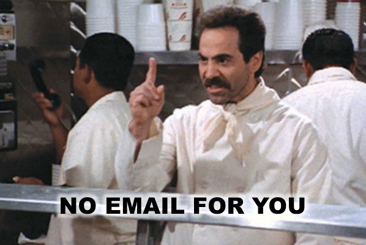

# Présentation de la désinscription {#understanding-unsubscribe}

Il existe en fait plusieurs types différents de désabonnements intégrés dans Marketo. Ils sont tous représentés par des champs sur l&#39;objet personne, tout comme Prénom.

>[!NOTE]
>
>Marketo est en train de modifier des termes tels que la Liste bloquée et la Liste autorisée à la Liste bloquée et à la Liste autorisée dans notre produit. Au cours de cette mise à jour, vous verrez peut-être les anciens termes de l’interface utilisateur et les captures d’écran de la documentation, ainsi que les nouveaux termes dans le texte de la documentation. Nous nous excusons pour toute confusion.

Tous ces champs sont intégrés à votre abonnement de marketing. Ils sont tous de type booléen (case à cocher). Ils peuvent être utilisés dans les étapes de flux Forms ou [Modifier la valeur des données](../../../product-docs/core-marketo-concepts/smart-campaigns/flow-actions/change-data-value.md).

## Non abonné {#unsubscribed}

Elle est utilisée sur la page de désabonnement standard. Si une personne coche cette case ou clique sur le lien de désabonnement dans un courrier électronique, elle ne reçoit plus d’e-mails marketing. Ils recevront toutefois [des courriels opérationnels](../../../product-docs/email-marketing/general/functions-in-the-editor/make-an-email-operational.md).

## Marketing suspendu {#marketing-suspended}

Ce champ est défini par l’utilisateur pour placer des personnes sur un désabonnement temporaire. Les utilisateurs ne peuvent atteindre cet état que s’ils sont modifiés manuellement ou si une étape de flux de valeur de données de modification est utilisée.

## Courriel suspendu {#email-suspended}

Ce statut bloque une personne qui envoie des messages pendant 24 heures après un rebond sévère. Au bout de 24 heures, la personne sera à nouveau en mesure de recevoir des messages.

>[!NOTE]
>
>L’e-mail suspendu reste coché même après la fin de la période de 24 heures. Vous pouvez donc vous référer à des personnes qui ont été historiquement marquées comme telles. Pour savoir si la personne est susceptible de recevoir un courrier, il vous suffit de calculer 24 heures après le moment de la suspension du courrier électronique.

## Placé sur la liste bloquée {#blocklisted}

[Utilisez-le pour des personnes comme des concurrents](http://docs.marketo.com/x/uwOQ). Toute personne désirant recevoir des **non** courriels : opérationnel, marketing, etc. Ils n&#39;ont rien !

