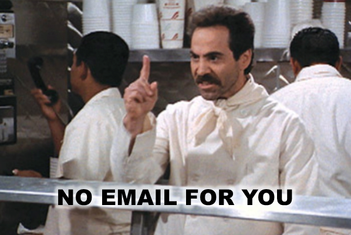

# Présentation du désabonnement {#understanding-unsubscribe}

Il existe en fait plusieurs types différents de désabonnements intégrés dans Marketo. Ils sont tous représentés par des champs sur l’objet personne, tout comme Prénom.

Tous ces champs sont intégrés à votre abonnement Marketo. Ils sont tous de type booléen (case à cocher). Ils peuvent être utilisés dans les étapes de flux Forms ou [Modifier la valeur des données](/help/marketo/product-docs/core-marketo-concepts/smart-campaigns/flow-actions/change-data-value.md).

## Désabonné ou désabonnée {#unsubscribed}

Cette option est utilisée sur la page de désabonnement standard. Si une personne coche cette case ou clique sur le lien de désabonnement dans un e-mail, elle ne recevra plus d’e-mails marketing. Ils recevront toutefois des [courriels opérationnels](/help/marketo/product-docs/email-marketing/general/functions-in-the-editor/make-an-email-operational.md).

## Marketing interrompu {#marketing-suspended}

Ce champ est défini par l&#39;utilisateur pour placer des personnes sur un désabonnement temporaire. Les personnes ne peuvent obtenir ce statut que si elles sont modifiées manuellement ou si une étape de flux Modifier la valeur des données est utilisée.

## E-mail interrompu {#email-suspended}

Ce statut empêche une personne d’envoyer des emails pendant 24 heures après un hard bounce. Au bout de 24 heures, la personne redeviendra publiable.

>[!NOTE]
>
>L’option E-mail suspendu restera cochée même après la fin de la période de 24 heures. Vous pouvez donc vous référer à des personnes qui ont été historiquement marquées comme telles. Pour savoir si la personne est susceptible de recevoir un courrier, calculez simplement 24 heures après le moment de la suspension de l’e-mail.

## Figurant sur la liste bloquée {#blocklisted}

[Utilisez cette option pour les personnes comme les concurrents](/help/marketo/product-docs/core-marketo-concepts/smart-lists-and-static-lists/managing-people-in-smart-lists/add-person-to-blocklist.md). Toute personne que vous souhaitez recevoir **pas** d’e-mails, qu’il s’agisse d’opérations, de marketing, etc. Ils n&#39;ont rien !

