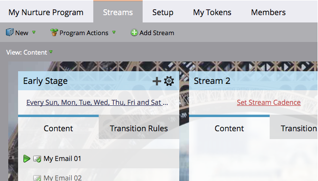

# Ajout d’une diffusion {#add-a-stream}

Les programmes d’engagement peuvent contenir plusieurs flux. Voici comment en ajouter un nouveau.

1. Accédez à **Activités marketing**.

   

1. Sélectionnez votre programme d’engagement et cliquez sur l’onglet **Flux** .

   

1. Cliquez sur **Ajouter un flux**.

   

   >[!NOTE]
   >
   >Vous pouvez ajouter jusqu’à 25 diffusions par programme d’engagement.

   Et... fini !

   
