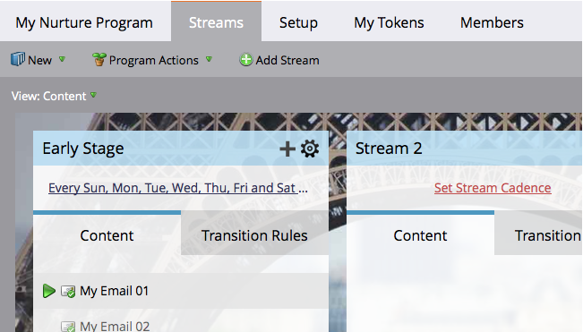

# Ajouter un flux {#add-a-stream}

Les programmes de mobilisation peuvent comporter plusieurs volets. Voici comment en ajouter un nouveau.

1. Accédez à **[!UICONTROL Activités marketing]**.

   

1. Sélectionnez votre programme d’engagement et cliquez sur l’onglet **[!UICONTROL Flux]**.

   

1. Cliquez sur **[!UICONTROL Ajouter un flux]**.

   

   >[!NOTE]
   >
   >Vous pouvez ajouter jusqu’à 25 flux par programme d’engagement.

   Et... fini !

   
