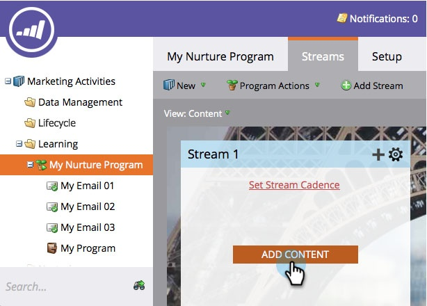

# Ajouter du contenu à un flux {#add-content-to-a-stream}

Une fois votre programme d’engagement créé, vous devez ajouter du contenu aux flux. Vous pouvez ajouter des courriers électroniques ou des programmes à un flux.

## Ajouter un courriel à un flux {#add-an-email-to-a-stream}

1. Accédez à Activités **** marketing.

   

1. Sélectionnez votre programme d’engagement et accédez à l’onglet **Flux** .

   

   Vous pouvez ajouter le premier courriel de trois manières différentes :

**Bouton Ajouter le contenu**

1. Cliquez sur le bouton **Ajouter le contenu** .

   

1. Laissez le **Type** défini sur **Courriel**, puis sélectionnez le courriel à ajouter.

   

   >[!TIP]
   >
   >Les courriels locaux de ce programme d’engagement seront triés par-dessus.

**Stream + Icon**

1. Cliquez sur l’icône en forme de flux **+** , laissez **Type** comme **Courriel**, puis sélectionnez le courriel à ajouter.

   

**Glisser-déposer**

1. Faites simplement glisser le courrier électronique de l’arborescence dans le flux.

   

## Ajouter un Programme à un flux {#add-a-program-to-a-stream}

1. Accédez à Activités **** marketing.

   

1. Sélectionnez votre programme d’engagement et accédez à l’onglet **Flux** .

   

   Vous pouvez ajouter un programme à votre flux de trois manières différentes :

**Bouton Ajouter le contenu**

1. Cliquez sur **Ajouter le contenu**.

   

1. Remplacez **Type** par Programme.

   

1. Recherchez et sélectionnez le programme.

   

1. Maintenant, sélectionnez la campagne intelligente dans le programme que vous voulez que les gens traversent.

   

   >[!NOTE]
   >
   >**Rappel**
   >
   >
   >Pour que cette campagne intelligente fonctionne correctement, le Programme **** membre de l’engagement doit être filtré.

**Stream + Icon**

1. Cliquez sur l’icône **+** de diffusion en continu, puis définissez **Type** sur Programme.

   

1. Recherchez et sélectionnez votre programme.

   

1. Sélectionnez la campagne intelligente dans laquelle vous souhaitez que les personnes soient traitées.

   

**Glisser-déposer**

1. Faites glisser et déposez le programme de votre choix depuis l’arborescence dans votre flux.

   

1. Maintenant, sélectionnez la campagne intelligente que vous voulez que les gens suivent.

   

Super boulot ! Vous connaissez maintenant différentes manières d’ajouter du contenu à vos flux de programme. Ajoutez autant que nécessaire pour votre culture. Consultez l&#39;article correspondant ci-dessous pour plus de détails.

>[!NOTE]
>
>**Articles connexes**
>
>* [Ajouter un Programme à un flux de Programme d’engagement](adding-a-program-to-an-engagement-program-stream.md)

>

