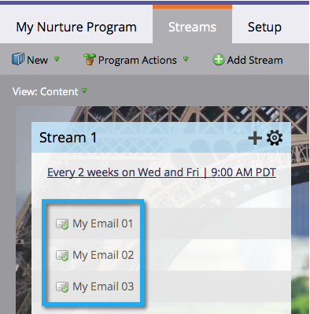

# Présentation des Programmes d’engagement {#understanding-engagement-programs}

Les programmes d’engagement sont conçus pour promouvoir les nouvelles personnes en leur présentant du contenu de manière systématique.

>[!NOTE]
>
>**FYI**
>
>Marketo est maintenant en train de normaliser la langue dans tous les abonnements. Vous pouvez donc voir des pistes dans votre abonnement et des personnes/personnes dans docs.marketo.com. Ces termes signifient la même chose ; cela n&#39;a aucune incidence sur les instructions relatives aux articles. Il y a aussi d&#39;autres changements. [En savoir plus](http://docs.marketo.com/display/DOCS/Updates+to+Marketo+Terminology).

>[!NOTE]
>
>Il existe une limite de 100 programmes d’engagement **principaux** par abonnement.

## Programme d’engagement {#engagement-program}

Un **engagement pr*****ogramme** est un type de programme qui peut accomplir facilement une tâche complexe.

Article connexe :

* [Créer un Programme d’engagement](create-an-engagement-program.md)

## Flux {#stream}

Un **flux** est un ensemble de contenus prioritaires que le programme d&#39;engagement utilisera pour nourrir les gens.

Articles connexes :

* [Ajouter un flux](add-a-stream.md)
* [Clonage d’un flux](../../../../product-docs/email-marketing/drip-nurturing/engagement-program-streams/clone-a-stream.md)

## Contenu {#content}

Il existe deux types de **contenu** que vous pouvez ajouter aux flux de programme d’engagement : les courriels et les programmes. Des courriels seront envoyés aux personnes au moment de la distribution.

Articles connexes :

* [Ajouter du contenu à un flux](add-content-to-a-stream.md)
* [Donner la priorité au contenu du flux](../../../../product-docs/email-marketing/drip-nurturing/using-stream-content/prioritize-stream-content.md)
* [Modifier la disponibilité du contenu du flux](../../../../product-docs/email-marketing/drip-nurturing/using-stream-content/edit-availability-of-stream-content.md)
* [Supprimer le contenu du flux](../../../../product-docs/email-marketing/drip-nurturing/using-stream-content/remove-stream-content.md)
* [Archivage et désarchivage du contenu du flux](../../../../product-docs/email-marketing/drip-nurturing/using-stream-content/archive-and-unarchive-stream-content.md)

## Cast {#cast}

Un **cast** est le événement d’envoi de courriers électroniques à partir d’un Programme d’engagement.

>[!NOTE]
>
>Les Programmes d’engagement ne sont pas conçus pour être utilisés avec les courriers électroniques opérationnels.

## Cadence de diffusion {#stream-cadence}

Vous décidez quand un cast se produit en configurant la cadence **du** flux. C’est ainsi que vous planifiez l’affichage du contenu à intervalles réguliers.

` 

`

Article connexe :

* [Définir la cadence du flux](../../../../product-docs/email-marketing/drip-nurturing/engagement-program-streams/set-stream-cadence.md)

## Cadence {#person-cadence}

Une cadence **** personnelle est un état qui définit sa capacité à recevoir du contenu d’un programme d’engagement. Vous pouvez utiliser l’étape de flux de cadence **du Programme** Modifier l’engagement pour passer à En pause ou Normal.

` 

`

## Épuisé {#exhausted}

Une fois qu&#39;une personne a reçu chaque élément de contenu dans un flux, nous appelons la personne **Exhausted**.

>[!MORELIKETHIS]
>
>* [Personnes ayant extrait du contenu](../../../../product-docs/email-marketing/drip-nurturing/using-engagement-programs/people-who-have-exhausted-content.md)

>

## Niveau d’engagement du contenu {#content-engagement-level}

Le niveau d’engagement du contenu est un score de 0 à 100 points que Marketing attribuera à votre contenu. Ce nombre est déterminé par une formule sophistiquée qui utilise les éléments suivants : ouverture, clics, désabonnement, réussite de programme et autres facteurs.

>[!MORELIKETHIS]
>
>* [Présentation de la note d’engagement](../../../../product-docs/email-marketing/drip-nurturing/reports-and-notifications/understanding-the-engagement-score.md)

>

