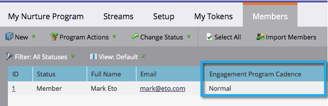

# Présentation des programmes d’engagement {#understanding-engagement-programs}

Les programmes d’engagement sont conçus pour être commercialisés auprès de nouvelles personnes en leur présentant du contenu de manière systématique.

>[!NOTE]
>
>Il existe une limite de 100 programmes d’engagement **actifs** par abonnement.

## Programme d’engagement {#engagement-program}

Un **programme d’engagement** est un type de programme qui peut accomplir facilement des tâches de fidélisation complexes.

>[!MORELIKETHIS]
>
>[Créer un programme d’engagement](/help/marketo/product-docs/email-marketing/drip-nurturing/creating-an-engagement-program/create-an-engagement-program.md)

## Stream {#stream}

Un **stream** est un pool de contenu prioritaire que le programme d’engagement utilisera pour fidéliser les personnes.

>[!MORELIKETHIS]
>
>* [Ajouter un stream](/help/marketo/product-docs/email-marketing/drip-nurturing/creating-an-engagement-program/add-a-stream.md)
>* [Cloner un stream](/help/marketo/product-docs/email-marketing/drip-nurturing/engagement-program-streams/clone-a-stream.md)

## Contenu {#content}

Il existe deux types de **contenu** que vous pouvez ajouter aux streams des programmes d’engagement : les e-mails et les programmes. Les e-mails seront envoyés aux personnes au moment de la conversion.

>[!MORELIKETHIS]
>
>* [Ajouter du contenu à un stream](/help/marketo/product-docs/email-marketing/drip-nurturing/creating-an-engagement-program/add-content-to-a-stream.md)
>* [Prioriser le contenu de stream](/help/marketo/product-docs/email-marketing/drip-nurturing/using-stream-content/prioritize-stream-content.md)
>* [Modifier la disponibilité du contenu de stream](/help/marketo/product-docs/email-marketing/drip-nurturing/using-stream-content/edit-availability-of-stream-content.md)
>* [Supprimer du contenu de stream](/help/marketo/product-docs/email-marketing/drip-nurturing/using-stream-content/remove-stream-content.md)
>* [Archiver et désarchiver du contenu de stream](/help/marketo/product-docs/email-marketing/drip-nurturing/using-stream-content/archive-and-unarchive-stream-content.md)

## Conversion {#cast}

Une **conversion** est l’événement d’envoi d’e-mails provenant d’un programme d’engagement.

>[!NOTE]
>
>Les programmes d’engagement ne sont pas conçus pour être utilisés avec des e-mails opérationnels.

## Rythme du stream {#stream-cadence}

Vous décidez du moment où une conversion se produit en configurant le **rythme du stream**. C’est ainsi que vous planifiez la sortie du contenu à intervalles réguliers.

>[!MORELIKETHIS]
>
>[Définir la cadence du stream](/help/marketo/product-docs/email-marketing/drip-nurturing/engagement-program-streams/set-stream-cadence.md)

## Rythme de personne {#person-cadence}

Un **rythme de personne** est un statut qui définit sa capacité à recevoir du contenu d’un programme d’engagement. Vous pouvez utiliser l’étape de flux **[!UICONTROL Modifier le rythme du programme d’engagement]** pour définir cette valeur sur [!UICONTROL En pause] ou [!UICONTROL Normal].

## Épuisé {#exhausted}

Une fois qu’une personne a reçu chaque élément de contenu dans un flux, elle est appelée **Épuisée**.

>[!MORELIKETHIS]
>
>[Personnes ayant épuisé le contenu](/help/marketo/product-docs/email-marketing/drip-nurturing/using-engagement-programs/people-who-have-exhausted-content.md)

## Niveau d’engagement avec le contenu {#content-engagement-level}

Le niveau d’engagement avec le contenu est un score compris entre 0 et 100 points que Marketo attribue à votre contenu. Ce nombre est déterminé à l’aide d’une formule sophistiquée qui tient compte des ouvertures, des clics, des désinscriptions, du succès du programme et d’autres facteurs.

>[!MORELIKETHIS]
>
>[Présentation du score d’engagement](/help/marketo/product-docs/email-marketing/drip-nurturing/reports-and-notifications/understanding-the-engagement-score.md)
