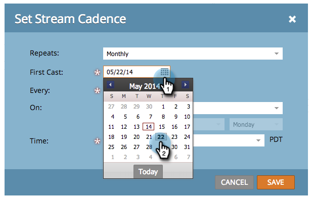

# Définir la cadence de diffusion {#set-stream-cadence}

Vous pouvez envoyer le contenu de l’engagement à n’importe quel intervalle. Par exemple : une fois par semaine ou tous les trois mardis du mois.

## Définir la cadence {#set-cadence}

1. Accédez à **Activités marketing**.

   

1. Recherchez et sélectionnez votre programme d’engagement, cliquez sur l’onglet **Flux**, puis sur **Définir le cadence de diffusion**.

   

1. Sélectionnez la fréquence à laquelle la cadence doit se répéter. Vous pouvez choisir **Hebdomadaire** ou **Mensuel**.

## {#weekly} hebdomadaire

1. Sélectionnez **Hebdomadaire**.

   

   >[!NOTE]
   >
   >Si vous sélectionnez **Aucun**, le flux s’arrête.

1. Choisissez la date de la première distribution.

   

1. Maintenant, choisissez si vous voulez que la cadence se produise toutes les semaines ou plus. Choisissons toutes les 2 semaines.

   

1. Déterminez les jours de la semaine. Dans ce cas, faisons les mardi, mercredi et jeudi.

   

   >[!TIP]
   >
   >Vous pouvez définir votre cadence pour qu’elle s’exécute tous les jours en sélectionnant **Répétées : Hebdomadairement** / **Toutes les : 1 Semaine** / **On** : tous les jours.

   Maintenant, sélectionnez l&#39;Heure. Cochez la case si vous souhaitez utiliser [Fuseau horaire du Destinataire](/help/marketo/product-docs/email-marketing/drip-nurturing/engagement-program-streams/set-stream-cadence/schedule-engagement-programs-with-recipient-time-zone.md)(c’est-à-dire diffuser selon les fuseaux horaires locaux), puis cliquez sur **Enregistrer**.

   

   >[!CAUTION]
   >
   >Le contenu sortira à la date que vous sélectionnez pour la première diffusion, assurez-vous qu’il coïncide avec le jour de la semaine que vous choisissez ; sinon, elle sera diffusée deux fois la première semaine.

1. Passez la souris sur la cadence. Vous verrez quels jours les futures émissions sortiront.

   

   >[!NOTE]
   >
   >Dans cet exemple, un courriel sera envoyé le jeudi. Nous sauterons ensuite une semaine et nous enverrons de nouveau le mardi, mercredi et jeudi de la semaine suivante. Et puis nous bouclons à nouveau.

C&#39;est tout ! Continuez à lire si vous souhaitez configurer une cadence mensuelle.

## Mois {#monthly}

1. Sélectionnez **Mensuel** pour connaître la fréquence à laquelle il se répète.

   

1. Choisissez la date de la première distribution.

   

1. Sélectionnez cette option si vous souhaitez qu&#39;elle soit espacée tous les mois ou plus... Choisissons tous les quatre mois.

   

1. Sélectionnez le jour du mois que vous avez spécifié, dans ce cas le 22 de chaque quatrième mois.

   

   >[!TIP]
   >
   >Vous pouvez également choisir le jour de la semaine.

1. Sélectionnez une **Heure** et cliquez sur **Enregistrer**.

   

1. Passez la souris sur la cadence. Vous verrez quels jours les futures émissions sortiront.

   

   >[!CAUTION]
   >
   >Si vous décidez de modifier ultérieurement la cadence de votre flux d’engagement, assurez-vous que la première diffusion est définie sur une date ultérieure.

Maintenant, vous savez comment mettre en place une cadence de flux !

>[!MORELIKETHIS]
>
>* [Présentation du fuseau horaire Destinataire](/help/marketo/product-docs/email-marketing/email-programs/email-program-actions/scheduling-with-recipient-time-zone/understanding-recipient-time-zone.md)
>* [Planification des Programmes d’engagement avec fuseau horaire Destinataire](/help/marketo/product-docs/email-marketing/drip-nurturing/engagement-program-streams/set-stream-cadence/schedule-engagement-programs-with-recipient-time-zone.md)

