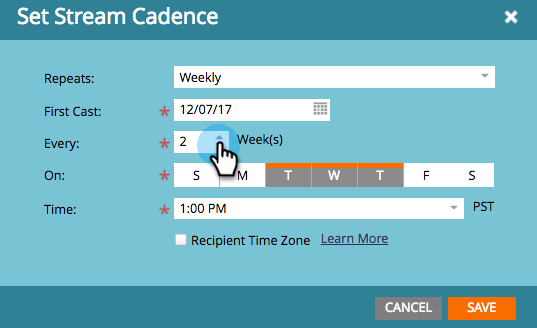

# Définir le rythme du stream {#set-stream-cadence}

Vous pouvez envoyer le contenu de l’engagement à tout moment. Par exemple : une fois par semaine ou tous les trois mardis du mois.

## Définir le rythme {#set-cadence}

1. Accédez à **Activités marketing**.

   

1. Recherchez et sélectionnez votre programme d’engagement, cliquez sur l’onglet **Flux**, puis cliquez sur **Définir la cadence de diffusion**.

   

1. Sélectionnez la fréquence à laquelle vous souhaitez que la cadence se répète. Vous pouvez choisir **Hebdomadaire** ou **Mensuel**.

## Une fois par semaine {#weekly}

1. Sélectionnez **Hebdomadaire**.

   

   >[!NOTE]
   >
   >Si vous sélectionnez **Aucun**, la diffusion s’arrête.

1. Choisissez la date de la première diffusion.

   

1. Maintenant, choisissez si vous souhaitez que la cadence se produise chaque semaine ou plus dans l&#39;espace. Prenons toutes les 2 semaines.

   

1. Déterminez les jours de la semaine. Dans ce cas, faisons les mardi, mercredi et jeudi.

   

   >[!TIP]
   >
   >Vous pouvez définir votre cadence pour qu’elle s’exécute tous les jours en sélectionnant **Répétées : hebdomadaires** / **Toutes les : 1 semaine** / **On** : tous les jours.

   Maintenant, choisissez l&#39;Heure. Cochez la case si vous souhaitez utiliser le [Fuseau horaire du destinataire](/help/marketo/product-docs/email-marketing/drip-nurturing/engagement-program-streams/set-stream-cadence/schedule-engagement-programs-with-recipient-time-zone.md) (c’est-à-dire diffuser selon les fuseaux horaires locaux), puis cliquez sur **Enregistrer**.

   

   >[!CAUTION]
   >
   >Le contenu sortira à la date que vous choisissez pour la première diffusion, donc assurez-vous qu&#39;il correspond au jour de la semaine de votre choix, sinon il sortira deux fois la première semaine.

1. Passez la souris sur le cadence. Vous verrez les jours où les futures émissions vont sortir.

   

   >[!NOTE]
   >
   >Dans cet exemple, un email sera envoyé le jeudi. Ensuite, nous ignorons une semaine et nous renvoyons le mardi, le mercredi et le jeudi de la semaine suivante. Et puis nous faisons à nouveau la boucle.

C&#39;est tout ! Continuez à lire si vous souhaitez configurer une cadence mensuelle.

## Une fois par mois {#monthly}

1. Sélectionnez **Mensuel** pour connaître la fréquence de répétition.

   

1. Choisissez la date de la première diffusion.

   

1. Choisissez si vous souhaitez qu’il soit espacé tous les mois ou plus... Prenons tous les quatre mois.

   

1. Choisissez le jour du mois que vous avez spécifié, ici le 22 de chaque quatrième mois.

   

   >[!TIP]
   >
   >Vous pouvez également choisir le jour de la semaine.

1. Sélectionnez une **Heure** et cliquez sur **Enregistrer**.

   

1. Passez la souris sur le cadence. Vous verrez les jours où les futures émissions vont sortir.

   

   >[!CAUTION]
   >
   >Si vous décidez de modifier ultérieurement votre cadence de flux d’engagement, assurez-vous que la première diffusion est définie sur une date ultérieure.

Maintenant, vous savez comment configurer une cadence de diffusion en continu !

>[!MORELIKETHIS]
>
>* [Comprendre le fuseau horaire du destinataire](/help/marketo/product-docs/email-marketing/email-programs/email-program-actions/scheduling-with-recipient-time-zone/understanding-recipient-time-zone.md)
>* [Planification des programmes d’engagement avec fuseau horaire du destinataire](/help/marketo/product-docs/email-marketing/drip-nurturing/engagement-program-streams/set-stream-cadence/schedule-engagement-programs-with-recipient-time-zone.md)
