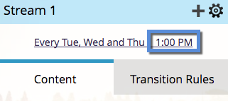

# Planifier des programmes d’engagement avec le fuseau horaire de la personne destinataire {#schedule-engagement-programs-with-recipient-time-zone}

Lorsque vous planifiez un flux de programme d’engagement et que le fuseau horaire du destinataire est actif, la diffusion du programme commence à s’exécuter à minuit dans le premier fuseau horaire (UTC +14:00). Nous exigeons que vous planifiiez la première distribution **au moins 25 heures** à l&#39;avenir parce qu&#39;il peut y avoir des gens qui sont admissibles à la distribution dans tous les fuseaux horaires à travers le monde. Le fait de commencer le traitement à cette heure dans le premier fuseau horaire garantit que nous enverrons l’e-mail à la date et à l’heure planifiées pour chaque destinataire.

1. Dans votre programme d’engagement, accédez à l’onglet **[!UICONTROL Flux]** et cliquez sur le planning de cadence d’un flux pour le modifier.

   

1. [Définissez vos paramètres de cadence](/help/marketo/product-docs/email-marketing/drip-nurturing/engagement-program-streams/set-stream-cadence.md) comme vous le feriez normalement, puis cochez la case **[!UICONTROL Fuseau horaire du destinataire]**. Rappelez-vous que votre premier casting doit être au moins 25 heures à l&#39;avenir. Cliquez sur **[!UICONTROL Enregistrer]**

   

1. Notez qu’avec le fuseau horaire du destinataire actif, la planification de cadence n’affiche pas de fuseau horaire spécifique, car il peut y en avoir plusieurs. Seule l’heure s’affiche.

   

>[!MORELIKETHIS]
>
>* [Présentation du fuseau horaire du destinataire](/help/marketo/product-docs/email-marketing/email-programs/email-program-actions/scheduling-with-recipient-time-zone/understanding-recipient-time-zone.md)
>* [Définir la cadence du flux](/help/marketo/product-docs/email-marketing/drip-nurturing/engagement-program-streams/set-stream-cadence.md)
