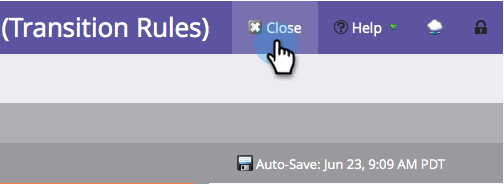

# Transférer des personnes entre des flux d’engagement {#transition-people-between-engagement-streams}

Les programmes de mobilisation peuvent avoir plusieurs volets. Si vous [ajoutez un flux](/help/marketo/product-docs/email-marketing/drip-nurturing/creating-an-engagement-program/add-a-stream.md), définissez une manière pour les personnes de passer d’un flux à un autre. Elles sont appelées **règles de transition**.

1. Accédez à **[!UICONTROL Activités marketing]**.

   

1. Sélectionnez votre programme d’engagement à flux multiples et accédez à **[!UICONTROL Flux]**.

   

1. Cliquez sur **[!UICONTROL Règles de transition]** pour le flux que vous souhaitez extraire d’autres flux, puis cliquez sur **[!UICONTROL Modifier les règles de transition]**.

   

   >[!NOTE]
   >
   >Les règles de transition extraient dans un flux ; définissez toujours les règles sur le flux que vous souhaitez extraire.

   Une fois la fenêtre des règles de transition ouverte, recherchez et faites glisser le déclencheur de votre choix. Dans cet exemple, les personnes seront déplacées dans [!UICONTROL Phase intermédiaire] lorsqu’elles seront ajoutées à une opportunité.

   

1. Définissez l’opérateur sur **[!UICONTROL est n’importe lequel]** afin que les personnes soient transférées pour toute opportunité ajoutée.

   

   >[!TIP]
   >
   >Vous pouvez ajouter plusieurs déclencheurs et filtres à une règle de transition, mais celle-ci utilise tous les filtres (utiliser TOUS les filtres est la seule option). Si vous devez utiliser OU dans une règle de transition, il est recommandé de configurer plutôt une campagne intelligente externe.

1. Cliquez sur **[!UICONTROL Fermer]**.

   

   Désormais, toute personne de votre programme d’engagement ajoutée à une opportunité sera déplacée dans le flux [!UICONTROL Phase intermédiaire].

   

   >[!NOTE]
   >
   >Les étapes décrites ci-dessus *do* s’appliquent également aux personnes [en pause](/help/marketo/product-docs/email-marketing/drip-nurturing/using-engagement-programs/pause-people-in-an-engagement-program.md).
