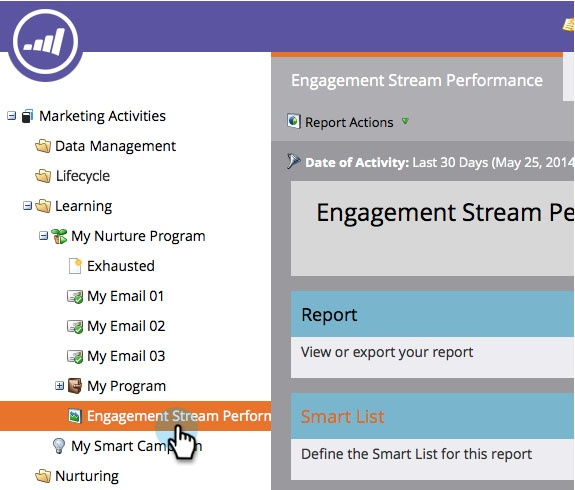

# Rapport Performance du flux d’engagement {#engagement-stream-performance-report}

Vous souhaitez connaître les performances de votre contenu d’engagement ? Essayez le rapport de performances du flux d’engagement.

## Créer le rapport {#create-the-report}

1. Recherchez et sélectionnez votre programme d’engagement, puis sous **New** cliquez sur **New Local Asset**.

   

1. Sélectionnez **Rapport**.

   

   >[!TIP]
   >
   >La création du rapport sous le programme se limite automatiquement au contenu du programme.

   Sélectionnez Performance du flux d’engagement comme type de rapport.
   

1. Nommez votre rapport et cliquez sur **Créer**.

   

   D&#39;accord ! Maintenant, examinons les paramètres.

## Modifier les paramètres {#edit-settings}

1. Recherchez et sélectionnez votre rapport.

   

1. Sous l&#39;onglet **Configuration**, cliquez sur le filtre **Courriel du Programme d&#39;engagement** en appuyant sur le doublon.

   

1. Sélectionnez le(s) courriel(s) sur lequel vous souhaitez générer un rapport et cliquez sur **Appliquer**.

   

## Exécuter le rapport {#run-report}

1. Pour exécuter le rapport, il vous suffit de cliquer sur l&#39;onglet **Rapport**.

   

   >[!TIP]
   >
   >
   >Bien qu’elle ne soit pas illustrée, la note d’engagement est une colonne de ce rapport. Voir [Présentation de la note d’engagement](understanding-the-engagement-score.md) pour plus d’informations sur ce qu’elle est.

   Super boulot ! Notez que le rapport est regroupé par programme d’engagement.

