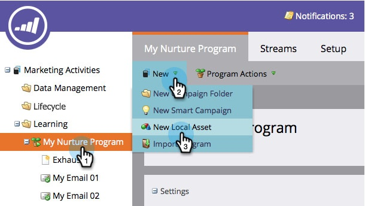
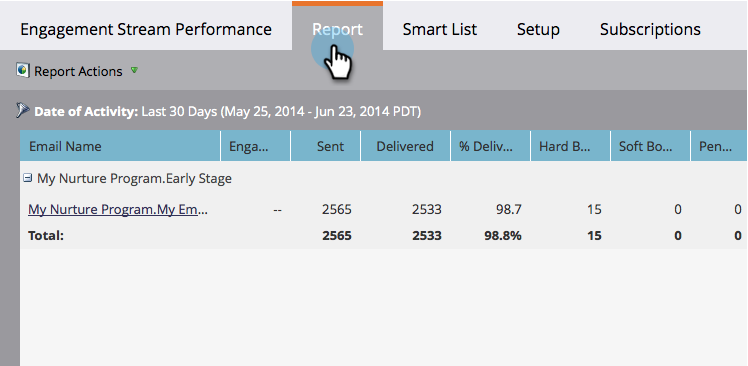

# Rapport Performances du flux d’engagement {#engagement-stream-performance-report}

Vous souhaitez connaître les performances de votre contenu d’engagement ? Essayez le rapport de performance du flux d’engagement.

## Créer le rapport {#create-the-report}

1. Recherchez et sélectionnez votre programme d’engagement, puis, sous **Nouveau**, cliquez sur **Nouvelle ressource locale**.

   

1. Sélectionnez **Rapport**.

   

   >[!TIP]
   >
   >La création du rapport dans le cadre du programme le limite automatiquement au contenu du programme.

   Sélectionnez Performances du flux d’engagement comme type de rapport.
   

1. Nommez votre rapport et cliquez sur **Créer**.

   

   D&#39;accord ! Maintenant, examinons les paramètres.

## Modifier les paramètres {#edit-settings}

1. Recherchez et sélectionnez votre rapport.

   

1. Sous l’onglet **Configuration**, double-cliquez sur le filtre **Email du programme d’engagement**.

   

1. Sélectionnez le ou les emails sur lesquels vous souhaitez créer un rapport et cliquez sur **Appliquer**.

   

## Exécuter le rapport {#run-report}

1. Pour exécuter le rapport, cliquez simplement sur l’onglet **Rapport** .

   

   >[!TIP]
   >
   >Bien qu’elle ne soit pas illustrée, la note d’engagement est une colonne de ce rapport. Voir [Présentation de la note d’engagement](/help/marketo/product-docs/email-marketing/drip-nurturing/reports-and-notifications/understanding-the-engagement-score.md) pour plus d’informations sur ce qu’elle est.

   Très bon travail ! Notez que le rapport est regroupé par programme d’engagement.
