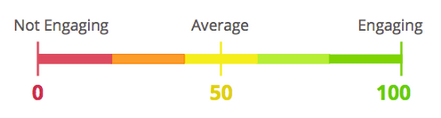

# Présentation du score d’engagement {#understanding-the-engagement-score}

Le score d’engagement facilite l’évaluation de l’efficacité du contenu de votre programme d’engagement. Le score va de 0 à 100. Consultez [le tableau de bord de l’engagement](/help/marketo/product-docs/email-marketing/drip-nurturing/reports-and-notifications/the-engagement-dashboard.md) pour savoir comment vous pouvez suivre les performances de votre contenu.

Le score est basé sur un algorithme propriétaire qui prend en compte le comportement engagé ([!UICONTROL Open], [!UICONTROL Click], [!UICONTROL Program Success]) et le comportement désengagé ([!UICONTROL Unsubscribe]). Il est comparé aux e-mails de type drip and nurture pour donner une moyenne de 50. Pour donner aux personnes la possibilité d’interagir avec votre contenu, le score d’engagement est calculé 72 heures après chaque casting. En outre, le score ne couvre que les données de **vos trois derniers lancements**.

>[!NOTE]
>
>Lorsque des programmes sont utilisés comme contenu dans les flux, le score d’engagement est basé sur l’appartenance au programme et le statut de réussite, **pas** l’interaction par e-mail (clics, ouvertures, désabonnements).

Les scores d’engagement sont universels pour tous les clients. Vous pouvez les comparer pour déterminer qui a le contenu le plus attrayant.

>[!NOTE]
>
>L’algorithme propriétaire s’applique également au score d’engagement dans les programmes de messagerie.

>[!MORELIKETHIS]
>
>[Présentation des programmes d’engagement](/help/marketo/product-docs/email-marketing/drip-nurturing/creating-an-engagement-program/understanding-engagement-programs.md)
