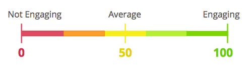

# Présentation de la note d’engagement {#understanding-the-engagement-score}

Le score d’engagement permet de déterminer facilement l’efficacité du contenu de votre programme d’engagement. Le score est compris entre 0 et 100. Consultez [le tableau de bord Engagement](/help/marketo/product-docs/email-marketing/drip-nurturing/reports-and-notifications/the-engagement-dashboard.md) pour voir comment vous pouvez suivre les performances de votre contenu.

Le score est basé sur un algorithme propriétaire qui prend en compte le comportement engagé (Ouverture, Clic, Succès du programme) et le comportement désengagé (Désabonnement). Elle est comparée à la goutte à goutte et aux messages électroniques de style nourrisse pour donner une moyenne de 50. Pour que les personnes puissent interagir avec votre contenu, le score d’engagement est calculé 72 heures après chaque diffusion. En outre, le score ne couvre que les données de **vos trois dernières** diffusions.

>[!NOTE]
>
>Lorsque les programmes sont utilisés comme contenu dans les flux, le score d’engagement est basé sur l’appartenance au programme et l’état de réussite, l’interaction email **et non** (clics, ouvertures, désabonnements).

Les scores d’engagement sont universels pour tous les clients. Vous pouvez les comparer pour déterminer qui possède le contenu le plus engageant.

>[!NOTE]
>
>L’algorithme propriétaire s’applique également au score d’engagement dans les programmes de messagerie.

>[!MORELIKETHIS]
>
>[Présentation des programmes d’engagement](/help/marketo/product-docs/email-marketing/drip-nurturing/creating-an-engagement-program/understanding-engagement-programs.md)
