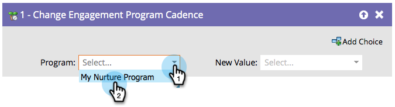

# Mettre les personnes en pause dans un programme d’engagement {#pause-people-in-an-engagement-program}

Lorsqu’une personne est membre d’un programme d’engagement, elle reçoit du contenu jusqu’à ce qu’elle [ait épuisé tout le contenu](people-who-have-exhausted-content.md). Vous pouvez utiliser l’étape de flux [Modifier la cadence du programme d’engagement](/help/marketo/product-docs/core-marketo-concepts/smart-campaigns/program-flow-actions/change-engagement-program-cadence.md) pour empêcher les personnes de recevoir du contenu même si le contenu n’est pas encore épuisé.

1. Sélectionnez le programme d’engagement.

   

1. Sélectionnez **En pause** comme **Nouvelle valeur** pour empêcher la personne de recevoir du contenu.

   

   Vous pouvez redéfinir la personne sur **Normal** si vous souhaitez qu’elle recommence à recevoir du contenu. Ils reprendront là où ils se sont arrêtés.

   >[!NOTE]
   >
   >La suspension d’une personne les empêchera de recevoir du contenu, mais elle continuera à faire la transition entre les flux s’ils répondent aux critères.
