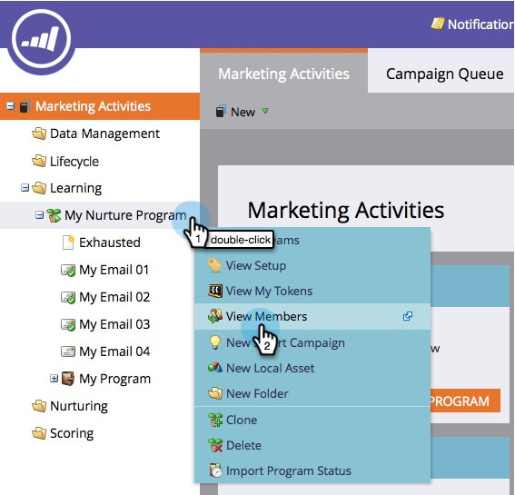

# Voir Membres d’un Programme d’engagement {#see-members-of-an-engagement-program}

Vous pouvez rapidement voir les membres d’un programme d’engagement. Voici comment.

1. Dans votre programme d&#39;engagement, cliquez avec le bouton droit de la souris et sélectionnez **Membres de la Vue.**

   

   >[!NOTE]
   >
   >La valeur de colonne [Contenu extrait](../../../../product-docs/email-marketing/drip-nurturing/creating-an-engagement-program/understanding-engagement-programs.md) est mise à jour après chaque diffusion.

1. Vous pouvez maintenant voir tous les membres de votre programme.

   

