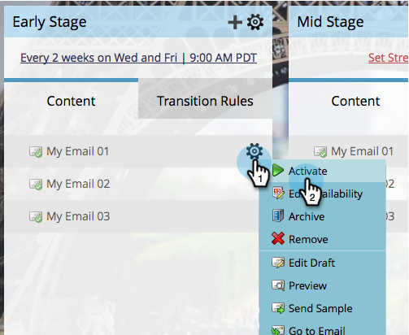

# Activer et désactiver le contenu en flux {#activate-and-deactivate-stream-content}

Par défaut, le contenu diffusé en continu est DÉSACTIVÉ. Activez le contenu pour les envoyer lors des lancements d’engagement.

## Activer le contenu du flux {#activate-stream-content}

1. Accédez à **[!UICONTROL Activités marketing]**.

   

1. Sélectionnez votre programme d’engagement et cliquez sur l’onglet **[!UICONTROL Flux]**.

   

1. Pointez sur le contenu à activer, cliquez sur l’icône en forme d’engrenage, puis sur **[!UICONTROL Activer]**.

   >[!NOTE]
   >
   >Les e-mails doivent être approuvés pour être activés.

   

   >[!TIP]
   >
   >Vous pouvez également activer tout le contenu d’un flux en cliquant sur l’icône d’engrenage au niveau supérieur, puis en cliquant sur **[!UICONTROL Activer tout le contenu]**.

## Désactiver le contenu du flux {#deactivate-stream-content}

1. Sélectionnez votre programme d’engagement et cliquez sur l’onglet **[!UICONTROL Flux]**.

   

1. Pointez sur le contenu à désactiver, cliquez sur l’icône en forme d’engrenage, puis sur **[!UICONTROL Désactiver]**.

   
