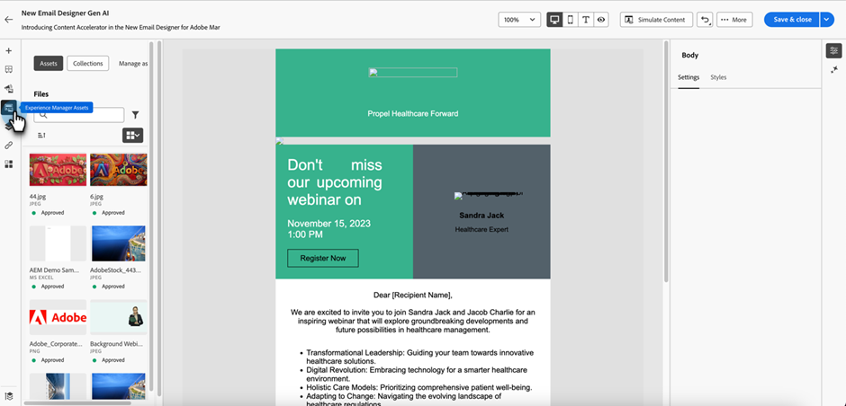

# Utilisation de ressources Experience Manager {#work-with-experience-manager-assets}

Lorsque _Adobe Experience Manager Assets as a Cloud Service_ est intégré à Adobe Marketo Engage, vous pouvez facilement accéder aux ressources numériques à utiliser dans votre contenu marketing. Lorsque vous créez votre contenu, les ressources sont accessibles à partir de l’élément _[!UICONTROL Experience Manager Assets]_ dans le volet de navigation de gauche.

>[!PREREQUISITES]
>
>Connecter la documentation MKTO/AEM.

>[!NOTE]
>
>Actuellement, seules les ressources d’image de _Adobe Experience Manager Assets_ sont prises en charge dans Marketo Engage. Les modifications apportées aux ressources doivent être effectuées à partir du référentiel central d’Adobe Experience Manager Assets. [En savoir plus](https://experienceleague.adobe.com/en/docs/experience-manager-cloud-service/content/assets/manage/manage-digital-assets)

Lorsque vous utilisez ces ressources numériques, les dernières modifications apportées à _Assets as a Cloud Service_ se propagent automatiquement aux campagnes par e-mail actives par le biais de références liées. Si des images sont supprimées dans _Adobe Experience Manager Assets as a Cloud Service_, elles apparaissent avec une référence rompue dans les e-mails. Lorsque des ressources actuellement utilisées dans Marketo Engage sont modifiées ou supprimées, les auteurs d’e-mails sont avertis des modifications de l’image. Toutes les modifications apportées aux ressources doivent être effectuées dans le référentiel central d’Adobe Experience Manager Assets.

## Utiliser AEM Assets comme source d’images {#use-aem-assets-as-the-image-source}

Si votre environnement comporte une ou plusieurs connexions au référentiel de ressources, vous pouvez désigner AEM Assets comme source des ressources lorsque vous créez ou affichez les détails d’un e-mail, d’un modèle d’e-mail ou d’un fragment visuel.

* Lors de la création de contenu, choisissez `AEM Assets` comme élément **[!UICONTROL Image Source]** dans la boîte de dialogue.

{width="400"}

* Lors de l’ouverture d’une ressource de contenu existante, choisissez `AEM Assets` dans la section _[!UICONTROL Corps]_ à droite.

{width="700" zoomable="yes"}

## Accès aux ressources pour la création {#access-assets-for-authoring}

>[!IMPORTANT]
>
>Un administrateur doit ajouter des utilisateurs qui doivent accéder aux ressources aux profils de produit Utilisateurs consommateurs Assets et/ou Utilisateurs Assets . [En savoir plus](https://experienceleague.adobe.com/en/docs/experience-manager-cloud-service/content/security/ims-support#managing-products-and-user-access-in-admin-console)

Dans l’éditeur de contenu visuel, cliquez sur l’icône Sélecteur de ressources _Experience Manager_ dans la barre latérale gauche. Le panneau Outils devient alors une liste des ressources disponibles dans le référentiel sélectionné.

{width="700" zoomable="yes"}

Si plusieurs référentiels AEM sont connectés, cliquez sur le bouton **[!UICONTROL Gérer en tant que]** pour choisir le référentiel à utiliser.

{width="700" zoomable="yes"}

Choisissez le référentiel de votre choix.

Il existe plusieurs méthodes pour ajouter une ressource d’image à la zone de travail visuelle :

* Glissez-déposez une miniature d’image à partir du volet de navigation de gauche.

{width="700" zoomable="yes"}

* Ajoutez un composant d’image à la zone de travail, puis cliquez sur **[!UICONTROL Parcourir]** pour afficher la boîte de dialogue _[!UICONTROL Sélectionner Assets]_.

  Dans la boîte de dialogue, vous pouvez choisir une image dans le référentiel sélectionné.

  Plusieurs outils sont disponibles pour vous aider à localiser la ressource dont vous avez besoin.

{width="700" zoomable="yes"}

* Modifiez le **[!UICONTROL Référentiel]** en haut à droite.

* Cliquez sur **[!UICONTROL Gérer les ressources]** en haut à droite pour ouvrir le référentiel Assets dans un autre onglet du navigateur et utiliser les outils de gestion d’AEM Assets.

* Cliquez sur le sélecteur _Type de vue_ en haut à droite pour remplacer l’affichage par **[!UICONTROL Vue Liste]**, **[!UICONTROL Vue Grille]**, **[!UICONTROL Vue Galerie]** ou **[!UICONTROL Vue Cascade]**.

* Cliquez sur l’icône _Ordre de tri_ pour modifier l’ordre de tri entre croissant et décroissant.

* Cliquez sur la flèche du menu **[!UICONTROL Trier par]** pour remplacer les critères de tri par **[!UICONTROL Nom]**, **[!UICONTROL Taille]** ou **[!UICONTROL Modifié]**.

* Cliquez sur l’icône _Filtrer_ en haut à gauche pour filtrer les éléments affichés en fonction de vos critères.

* Saisissez du texte dans le champ Rechercher pour filtrer les éléments affichés afin qu’ils correspondent au nom de la ressource.

{width="700" zoomable="yes"}
