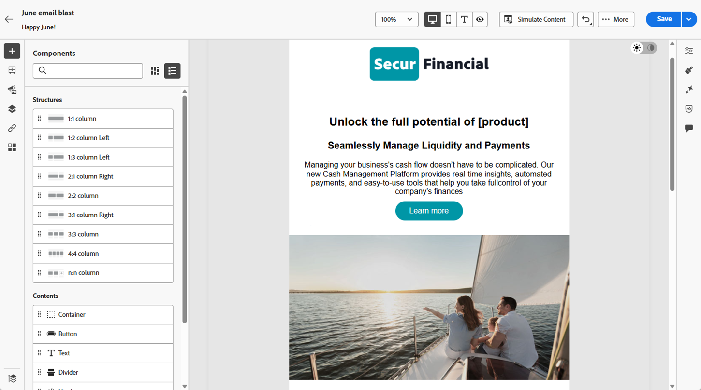

# Assistant AI pour Email Designer {#ai-assistant-email-designer}

L’assistant AI de Marketo Engage Email Designer vous permet de créer des e-mails contemporains, performants et intuitifs. Pour ce faire, Adobe utilise une technologie d’IA générative et une bibliothèque de prompts, ainsi que Firefly pour la génération d’images, qui permettent de créer du contenu adapté à une personne/un groupe d’achat spécifique, une étape de parcours marketing, une stratégie de communication, un ton, etc. Des ressources de marque spécifiques peuvent également être utilisées pour créer du contenu.

>[!PREREQUISITES]
>
>L’assistant AI n’est pas activé par défaut. Vous devez d’abord accepter les conditions générales [Core Gen-AI et les conditions supplémentaires](https://www.adobe.com/legal/terms/enterprise-licensing/genai-ww.html){target="_blank"} relatives à l’utilisation de la fonctionnalité Gen-AI dans le Designer d’e-mail. Pour plus d’informations, contactez l’équipe du compte Adobe (votre gestionnaire de compte).

## Configuration des autorisations {#set-up-permissions}

_Après_ conformément à la condition préalable ci-dessus, les administrateurs Marketo doivent appliquer l’accès à des utilisateurs/rôles spécifiques avant que les utilisateurs ne voient les boutons GenAI.

+++Découvrez comment configurer des autorisations

1. Dans Marketo Engage, cliquez sur **Admin** et sélectionnez **Utilisateurs et rôles**.

   

1. Dans l’onglet **Rôles**, double-cliquez sur le rôle souhaité.

   

1. Sous _Access Design Studio_, cochez la case **Accéder à l’assistant IA** et cliquez sur **Enregistrer**.

   

1. Cliquez sur l’onglet Utilisateurs et sélectionnez l’utilisateur auquel vous souhaitez accorder l’accès.

   

1. Sélectionnez le rôle que vous avez choisi à l’étape 3 et l’espace de travail souhaité (le cas échéant). Cliquez sur **Enregistrer**

   

+++

## Cas d’utilisation {#use-cases}

Il existe quelques cas d’utilisation principaux pour l’assistant AI :

* [Créer un objet et/ou un pré-titre](#create-a-subject-line-preheader) pour votre e-mail
* [Créer du contenu pour une section spécifique](#create-content-for-a-specific-section) de votre e-mail
* [Créer un e-mail entier](#create-an-entire-email) à partir d’un modèle sélectionné

## Créer une ligne d’objet/un pré-titre {#create-a-subject-line-preheader}

Vous pouvez utiliser l’assistant d’IA pour créer une ligne d’objet, un pré-titre, ou les deux.

L’exemple ci-dessous illustre la ligne d’objet. Pour un pré-titre, suivez les mêmes étapes en cochant la case _Pré-titre_ (illustré dans l’image ci-dessus).

Lors de la création d’un e-mail à l’aide du nouveau Designer d’e-mail, saisissez un objet temporaire.

Une fois l’e-mail créé, l’objet se trouve dans la colonne _Détails_ à droite. Cliquez sur le bouton de l’assistant d’IA (  ) en regard pour obtenir de l’aide sur la création d’une ligne d’objet à l’aide de la fonctionnalité IA dédiée aux généralités.

Activez l’option **Utiliser le contenu de référence** pour que l’Assistant IA personnalise le nouveau contenu en fonction du contenu sélectionné.

Saisissez l’invite de personnalisation de l’objet. Saisissez les paramètres de texte appropriés et chargez toutes les ressources de marque que vous souhaitez utiliser comme référence pour créer une ligne d&#39;objet appropriée.

Les paramètres de texte incluent :

<table><tbody>
  <tr>
    <td style="width:25%"><b>Groupe d’achat</b></td>
    <td>Groupe d'achat spécifique que vous ciblez (par exemple, praticien, influenceur, décideur).</td>
  </tr>
  <tr>
    <td style="width:25%"><b>Étape du Parcours marketing</b></td>
    <td>Les destinataires à une étape de parcours marketing particulière (par exemple, Découverte, Évaluation, Validation).</td>
  </tr>
  <tr>
    <td style="width:25%"><b>Stratégie De Communication</b></td>
    <td>L’objectif de la communication (par exemple, Urgent, Preuve sociale, Informatif).</td>
  </tr>
  <tr>
    <td style="width:25%"><b>Langue</b></td>
    <td>Langue dans laquelle vous souhaitez générer la ligne d'objet.</td>
  </tr>
  <tr>
    <td style="width:25%"><b>Ton</b></td>
    <td>Ton dans lequel vous souhaitez que le contenu soit généré (par exemple, Inspirant, Excitant, Humoristique).</td>
  </tr>
  <tr>
    <td style="width:25%"><b>Émoticônes</b></td>
    <td>Permet d’inclure des émoticônes dans le contenu généré.</td>
  </tr>
</tbody>
</table>

En cliquant sur **Générer**, vous accédez aux exemples suivants :

Vous pouvez également charger une ressource de marque pour utiliser le contenu de la ressource comme référence afin de créer l’objet.

Pour choisir une variation, cochez sa case et cliquez sur **Sélectionner**. Vous pouvez également l’ajuster en cliquant sur **Affiner**. De plus, vous pouvez fournir des commentaires en cliquant sur l’icône pouces vers le haut ou pouces vers le bas afin que la technologie Gen-AI apprenne vos préférences.

Une fois votre sélection effectuée, la ligne d&#39;objet est renseignée dans vos détails d&#39;e-mail.

## Créer du contenu pour une section spécifique de votre e-mail {#create-content-for-a-specific-section}

Une fois l’e-mail créé, vous avez la possibilité de modifier certaines sections, certaines images ou certains textes.

Dans cet exemple, nous utilisons un modèle financier. Si une ou plusieurs images existantes ne répondent pas à vos besoins, vous pouvez demander à l’assistant d’IA de créer une image basée sur votre description. Sélectionnez l’image souhaitée et cliquez sur l’icône de l’assistant d’IA .

Saisissez les détails pertinents dans l&#39;invite, par exemple : « Un banquier assis à son bureau avec des piles d&#39;argent. » Vous pouvez également utiliser la bibliothèque d’invites (à droite de l’invite) si vous n’êtes pas sûr de ce que vous devez saisir. Cliquez sur **Paramètres d’image**.

Cliquez sur le bouton pour activer _Générer des images à l’aide de l’IA_, puis modifiez tous les paramètres souhaités, y compris le modèle à utiliser (Adobe Firefly ou Gemini 2.5 Nano Banana). Lorsque vous avez terminé, cliquez sur **Générer**.

Plusieurs variantes sont créées. Choisissez votre favori et cliquez sur **Appliquer**.

>[!NOTE]
>
>Si aucune des images ne répond à vos besoins, cliquez de nouveau sur **Générer** pour créer de nouvelles versions.

Tout comme pour les images, les parties de texte de l’e-mail peuvent également être modifiées.

## Créer un e-mail entier à partir d’un modèle sélectionné {#create-an-entire-email}

Cette option n’est disponible que si l’e-mail est créé à l’aide d’un modèle existant. Il peut s’agir d’un modèle standard fourni par le Designer d’e-mail, d’un modèle enregistré que vous avez déjà créé ou d’un modèle importé à l’aide de l’option Importer HTML . Cette option n’est pas disponible si vous choisissez [Créer en partant de zéro](/help/marketo/product-docs/email-marketing/email-designer/email-authoring.md#design-from-scratch) pour votre e-mail.

Sélectionnez un modèle, sans sélectionner de composant dans le modèle, puis cliquez sur le bouton de l’assistant AI dans le Designer d’e-mail.

Saisissez l’invite appropriée et choisissez les paramètres de texte, les ressources de marque et les paramètres d’image que vous souhaitez pour votre e-mail.

Si vous souhaitez générer des images à l’aide de Firefly, sélectionnez les paramètres d’image, puis le bouton (bascule) **Générer des images à l’aide de l’IA**.

Sélectionnez les _Type de contenu_, _Couleur et ton_, _Éclairage_ et _Composition_ de votre choix pour créer des images Gen-AI pour votre e-mail. Cliquez sur **Générer** lorsque vous avez terminé.

Découvrez à quoi ressemblera une variation dans votre e-mail en cliquant sur **Aperçu**. Choisissez une variation en cliquant sur **Appliquer**.
