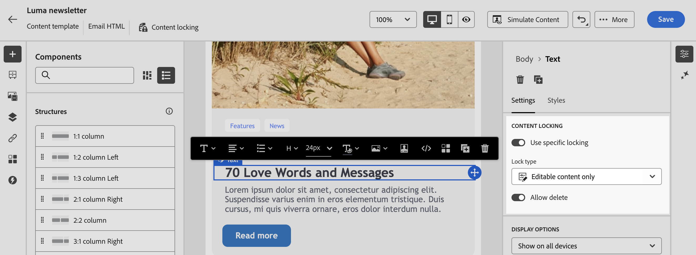

# Verrouillage de contenu dans les modèles d’e-mails {#lock-content-email-templates}

Marketo Engage vous permet de verrouiller le contenu de modèles d’e-mail en verrouillant le modèle entier ou des structures/composants spécifiques. Cela vous permet d’éviter les modifications ou suppressions involontaires, de mieux contrôler la personnalisation des modèles et d’améliorer l’efficacité et la fiabilité de vos campagnes par e-mail.

>[!AVAILABILITY]
>
>Les utilisateurs et les utilisatrices autorisés à créer des modèles de contenu peuvent activer le verrouillage de contenu.

Le verrouillage de contenu peut être appliqué au niveau **structure** ou au niveau **composant**.

* Lorsqu’une structure est verrouillée :

   * Tout le contenu de cette structure est également verrouillé.
   * Aucun contenu ne peut être ajouté à la structure.
   * Par défaut, vous ne pouvez pas supprimer la structure. Vous pouvez contourner cette restriction en activant l’option « Autoriser la suppression ».
   * Les composants de contenu individuels dans la structure verrouillée peuvent être définis comme modifiables.

* Lorsqu’une structure est modifiable (structure non verrouillée) :

   * Les composants de contenu individuels peuvent être verrouillés dans cette structure.
   * Par défaut, vous ne pouvez pas supprimer un composant s’il est verrouillé ou si l’option « Verrouillage de contenu modifiable uniquement » est sélectionnée. Vous pouvez contourner cette restriction en activant l’option « Autoriser la suppression ».

## Verrouillage d’un modèle d’e-mail {#lock-an-email-template}

### Activation du verrouillage de contenu {#enable-content-locking}

Vous pouvez activer le verrouillage de contenu pour un modèle d’e-mail directement dans le Designer d’e-mail, que vous créiez un nouveau modèle ou en modifiiez un existant.

1. Ouvrez ou créez un modèle d’e-mail et accédez à l’écran de modification du contenu dans le Concepteur d’e-mail.

1. Dans le volet **[!UICONTROL Corps]** à droite, activez l’option **[!UICONTROL Gouvernance]**.

1. Dans la liste déroulante **[!UICONTROL Mode]**, sélectionnez le mode de verrouillage souhaité pour le modèle :

   * **[!UICONTROL Verrouillage de contenu]** : verrouillez des sections spécifiques du contenu dans le modèle. Par défaut, toutes les structures et tous les composants deviennent modifiables. Vous pouvez ensuite verrouiller de manière sélective des éléments individuels.
   * **[!UICONTROL Lecture seule]** : verrouillez le contenu complet du modèle, ce qui empêche toute modification.

   {width="800" zoomable="yes"}

1. Si vous avez sélectionné le mode **[!UICONTROL Verrouillage de contenu]**, vous pouvez définir plus précisément comment les personnes peuvent interagir avec le modèle. Activez l’option **[!UICONTROL Activer l’édition du contenu]** et choisissez l’une des options suivantes :

   * **[!UICONTROL Autoriser l’ajout de structure et de contenu]** : les personnes peuvent ajouter des structures entre des structures existantes et ajouter des composants de contenu ou des fragments dans des structures modifiables.

   * **[!UICONTROL Autoriser l’ajout de contenu uniquement]** : les personnes peuvent ajouter des composants de contenu ou des fragments dans des structures modifiables, mais elles ne peuvent pas ajouter ni dupliquer des structures.

1. Après avoir sélectionné le mode de verrouillage, vous pouvez définir les structures et/ou composants à verrouiller si vous avez sélectionné le mode **[!UICONTROL Verrouillage du contenu]** :

   * [Découvrir comment verrouiller des structures](#lock-structures)
   * [Découvrir comment verrouiller des composants](#lock-components)

   Si vous avez choisi le mode **[!UICONTROL Lecture seule]**, vous pouvez procéder à la finalisation et à l’enregistrement de votre modèle.

Vous pouvez ajuster les paramètres de **[!UICONTROL gouvernance]** à tout moment lors de la conception de votre modèle en sélectionnant le corps du modèle. Pour ce faire, cliquez sur le lien **[!UICONTROL Corps]** dans le rail de navigation situé en haut du volet de droite.

{width="800" zoomable="yes"}

### Verrouillage des structures {#lock-structures}

Pour verrouiller une structure dans votre modèle :

1. Sélectionnez la structure à verrouiller.

1. Dans la liste déroulante **[!UICONTROL Type de verrouillage]**, sélectionnez **[!UICONTROL Verrouillé]**.

   {width="800" zoomable="yes"}

   >[!NOTE]
   >
   >Par défaut, les utilisateurs et les utilisatrices ne peuvent pas supprimer les structures verrouillées. Vous pouvez contourner cette restriction en activant l’option **[!UICONTROL Autoriser la suppression]**.

Après le verrouillage d’une structure, aucun autre composant de contenu ou fragment ne peut être dupliqué ou ajouté à l’intérieur. Tous les composants d’une structure verrouillée sont également verrouillés par défaut. Pour rendre un composant modifiable dans une structure verrouillée :

1. Sélectionnez le composant que vous souhaitez déverrouiller.

1. Activez l’option **[!UICONTROL Utiliser un verrouillage spécifique]**.

1. Dans la liste déroulante **[!UICONTROL Type de verrouillage]**, sélectionnez **[!UICONTROL Modifiable]**. Pour autoriser la modification du contenu tout en verrouillant les styles, sélectionnez **[!UICONTROL Contenu modifiable uniquement]**. [Découvrir comment verrouiller des composants](#lock-components)

   {width="800" zoomable="yes"}

### Verrouillage des composants {#lock-components}

Pour verrouiller un composant spécifique dans une structure :

1. Sélectionnez le composant et activez l’option **[!UICONTROL Utiliser un verrouillage spécifique]** dans le volet de droite.

1. Dans la liste déroulante **[!UICONTROL Type de verrouillage]**, sélectionnez l’option de verrouillage de votre choix :

   {width="800" zoomable="yes"}

   * **[!UICONTROL Verrouillage de contenu modifiable uniquement]** : verrouille les styles du composant, mais permet de modifier le contenu.
   * **[!UICONTROL Verrouillé]** : verrouille entièrement le contenu et les styles du composant.

   >[!NOTE]
   >
   >Le type de verrouillage **[!UICONTROL Modifiable]** permet aux personnes de modifier un composant, même dans une structure verrouillée. [Découvrir comment verrouiller des structures](#lock-structures)

1. Par défaut, les personnes ne peuvent pas supprimer les composants verrouillés. Vous pouvez activer la suppression en activant l’option **[!UICONTROL Autoriser la suppression]**.

### Identification du contenu verrouillé {#identify-locked-content}

Pour identifier facilement les structures et les composants verrouillés dans votre modèle, utilisez l’**[!UICONTROL arborescence de navigation]** située dans le menu de gauche. Ce menu présente une vue d’ensemble visuelle de tous les éléments de modèle, en mettant en surbrillance les éléments verrouillés avec une icône de verrouillage et les éléments modifiables avec une icône en forme de crayon.

Dans l’exemple ci-dessous, la gouvernance est activée pour le corps du modèle. *La structure 2* est verrouillée avec le *composant 1* modifiable, tandis que la *structure 3* est entièrement verrouillée.

{width="800" zoomable="yes"}

## Utilisation de modèles avec du contenu verrouillé {#use-templates-with-locked-content}

Lors de l’utilisation d’un modèle avec du contenu verrouillé, le message **[!UICONTROL Gouvernance activée]** s’affiche dans le volet de droite.

Selon le type de verrouillage appliqué au modèle, vous pouvez effectuer différentes actions sur les structures et composants du modèle. Pour identifier rapidement toutes les zones modifiables dans le modèle, activez l’option **[!UICONTROL Mettre les zones modifiables en surbrillance]**.

Par exemple, dans le modèle ci-dessous, toutes les zones sont modifiables, à l’exception de l’image supérieure qui a été verrouillée, ce qui signifie que vous ne pouvez pas la modifier ni la supprimer.

{width="800" zoomable="yes"}

Voici quelques exemples d&#39;édition d&#39;emails et de la configuration de verrouillage de contenu associée qui a été configurée :

<table>
<thead>
  <tr>
    <th>Type de verrouillage de contenu</th>
    <th>Configuration des modèles</th>
    <th>Modification d’e-mails</th>
  </tr></thead>
<tbody>
  <tr>
    <td>Modèle de contenu en lecture seule</td>
    <td></td>
    <td></td>
  </tr>
  <tr>
    <td>Le contenu complet est modifiable, mais les personnes ne peuvent pas ajouter de structure ou de composant.</td>
    <td></td>
    <td></td>
  </tr>
  <tr>
    <td>Structure verrouillée qui ne peut pas être supprimée.</td>
    <td></td>
    <td></td>
  </tr>
  <tr>
    <td>Composant avec des styles verrouillés et qui ne peut pas être supprimé. Les personnes peuvent uniquement modifier le contenu.</td>
    <td></td>
    <td></td>
  </tr>
  <tr>
    <td>Composant modifiable dans une structure verrouillée.</td>
    <td></td>
    <td></td>
  </tr>
</tbody>
</table>
