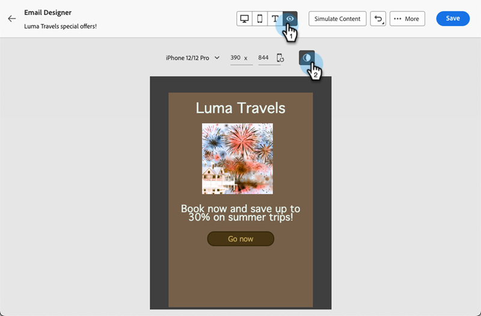

# Mode sombre {#dark-mode}

Lors de la conception de vos e-mails, le Designer d’e-mail vous permet de passer à la vue **[!UICONTROL Mode sombre]**.

En **[!UICONTROL mode sombre]**, vous pouvez définir des paramètres personnalisés spécifiques à afficher par la prise en charge des clients de messagerie lorsque leur mode sombre est activé.

## Présentation du mode sombre {#what-is-dark-mode}

Le mode sombre permet aux clients de messagerie et aux applications de messagerie de s’afficher avec des arrière-plans plus sombres et des couleurs plus claires pour le texte, les boutons et d’autres éléments de l’interface utilisateur. Cela permet de réduire la fatigue visuelle, d’économiser l’autonomie de la batterie et d’améliorer la lisibilité dans les environnements peu éclairés pour une expérience de visionnage plus confortable.

## Mécanismes de sécurisation {#guardrails}

Le rendu en mode sombre peut varier considérablement selon les clients de messagerie.

Avant d’utiliser le mode sombre, il est important de comprendre comment les principaux clients de messagerie le gèrent. Il existe trois cas :

### Clients qui ne prennent pas en charge le mode sombre. {#not-supporting}

Certains clients de messagerie ne prennent pas du tout en charge cette fonctionnalité, tels que :

* Yahoo!Mail
* AOL

Que vous définissiez ou non des paramètres personnalisés de mode sombre, ces clients de messagerie n’affichent aucun rendu de mode sombre.

### Clients qui appliquent leur propre mode sombre. {#default-support}

Certains clients de messagerie appliquent uniquement leur propre mode sombre par défaut pour tous les e-mails reçus. Les couleurs, les arrière-plans, les images, etc., sont automatiquement ajustés avec les paramètres de mode sombre spécifiques à ce client de messagerie. Aucune modification externe n’est possible.

Voici quelques exemples :

* Gmail (client de messagerie web de bureau, iOS, Android, client de messagerie web mobile)
* Outlook Windows
* Outlook Windows Mail

Dans ce cas, si vous définissez des paramètres de mode sombre personnalisés dans le Designer d’e-mail, ces paramètres sont remplacés par les paramètres du client de messagerie.

Ainsi, bien que ces clients de messagerie gèrent le mode sombre, votre conception de mode sombre spécifique ne sera pas rendue.

### Clients qui prennent en charge le mode sombre personnalisé. {#custom-dark-mode}

Certains clients de messagerie offrent la possibilité de rendre le mode sombre personnalisé avec la requête `@media (prefers-color-scheme: dark)`, qui est la méthode utilisée par le Designer de messagerie [!DNL Marketo Engage].

Les principaux clients gérant cette option sont les suivants :

* Apple Mail macOS
* Apple Mail iOS
* MacOS Outlook
* Outlook.com
* Outlook iOS
* Outlook Android

Les paramètres que vous définissez dans le Designer Email doivent s’afficher.

>[!NOTE]
>
>Découvrez comment définir des [paramètres personnalisés du mode sombre](#define-custom-dark-mode) dans le Designer d’e-mail.

Certaines restrictions peuvent s’appliquer en fonction de chaque client de messagerie. Par exemple, certains clients (par exemple, Apple Mail 16) ne généreront pas de mode sombre si des images sont présentes.

Pour des résultats optimaux, testez votre contenu dans les clients de messagerie ciblés. Pour voir une simulation dans chaque client, utilisez la fonctionnalité [Rendu des emails](/help/marketo/product-docs/email-marketing/email-designer/test-email-rendering.md) de la Designer des emails.

## Mode sombre dans le Concepteur d’e-mail {#dark-mode-email-designer}

En ce qui concerne le mode sombre dans le Concepteur d’e-mail, deux aspects doivent être pris en compte :

* Vous pouvez prévisualiser la manière dont le mode sombre par défaut s’affichera dans la plupart des clients de messagerie pris en charge. [En savoir plus](#preview-dark-mode)

* Si vous souhaitez remplacer les paramètres par défaut des clients de messagerie de prise en charge, vous pouvez définir des paramètres de mode sombre personnalisés dans l’e-mail que vous modifiez. [En savoir plus](#define-custom-dark-mode)

### Prévisualiser le mode sombre par défaut {#preview-dark-mode}

Découvrez comment accéder au mode sombre dans le Designer d’e-mail et obtenez un aperçu des paramètres par défaut du mode sombre.

1. Dans la page d’accueil du concepteur d’e-mail, cliquez sur le bouton **[!UICONTROL Créer en partant de zéro]**.

1. Ajoutez [structures et contenu](/help/marketo/product-docs/email-marketing/email-designer/email-authoring.md#add-structure-and-content) à votre e-mail.

1. En haut à droite, activez le bouton (bascule) **[!UICONTROL Mode sombre]**.

   

1. La prévisualisation du mode sombre par défaut s’affiche.

   

Par défaut, l’aperçu en mode sombre du Concepteur d’e-mail applique le modèle de couleurs « inversion complète des couleurs » à tous les éléments, à l’exception des images et des icônes.

Cela signifie qu’il détecte les zones comportant des éléments clairs et sombres et les inverse, de sorte que les arrière-plans clairs deviennent sombres et que le texte sombre devienne clair, tandis que les arrière-plans sombres deviennent clairs et que le texte clair devient sombre.

>[!CAUTION]
>
>Le rendu final peut varier en fonction du client de messagerie de la personne destinataire. Pour afficher une simulation pour chaque client de messagerie, utilisez la fonctionnalité [Rendu des e-mails](/help/marketo/product-docs/email-marketing/email-designer/test-email-rendering.md).

### Définir le mode sombre personnalisé {#define-custom-dark-mode}

Après avoir basculé en **[!UICONTROL mode sombre]**, vous pouvez choisir de modifier des éléments de style spécifiques de votre contenu qui s’afficheront uniquement lorsque le mode sombre sera activé dans le client de messagerie du destinataire (à condition qu’il prenne en charge cette fonctionnalité).

>[!IMPORTANT]
>
>Le rendu final en mode sombre dépend de chaque client de messagerie. Les résultats peuvent donc varier d&#39;un client à l&#39;autre. [En savoir plus](#guardrails)

Pour tirer parti du style du mode sombre personnalisé d’Email Designer, Marketo Engage utilise la requête CSS `@media (prefers-color-scheme: dark)`, qui détecte si le client de messagerie de l’utilisateur est en mode sombre et applique la conception avec thème sombre définie dans votre e-mail.

Pour définir les paramètres du mode sombre personnalisé, procédez comme suit.

1. Basculez vers l’[Aperçu en mode sombre](#preview-dark-mode) dans le Designer d’e-mail.

1. Modifiez les attributs de couleur de style, tels que le texte, les arrière-plans, les boutons, etc.

1. Vous ne pouvez pas modifier les couleurs des images et des icônes, mais vous pouvez définir des ressources spécifiques pour le mode sombre uniquement. Pour ce faire, sélectionnez une image. Passez en **[!UICONTROL mode sombre]** à l’aide du bouton dédié dans le volet **[!UICONTROL Paramètres]** et sélectionnez une autre ressource.

   

1. Vous pouvez à tout moment **[!UICONTROL Basculer vers la vue en direct]** afin de voir comment votre contenu peut s’afficher sur différentes tailles d’appareil. Dans cet affichage, sélectionnez le bouton (bascule) Mode sombre pour prévisualiser la version en mode sombre de votre contenu sur différents appareils.

   

   >[!NOTE]
   >
   >Le mode en direct est une prévisualisation générique conçue pour comparer l’aspect du rendu sur différentes tailles d’appareils. Le rendu final peut varier en fonction du client de messagerie de la personne destinataire.

1. Une fois que vous avez apporté les modifications souhaitées pour le mode sombre, cliquez sur **[!UICONTROL Simuler le contenu]**.

   

1. Sélectionnez **[!UICONTROL Rendu d’e-mail]** et connectez-vous à votre compte Litmus. Vous pouvez voir le rendu final en mode sombre pour divers clients de messagerie. En savoir plus sur le [Rendu des emails](/help/marketo/product-docs/email-marketing/email-designer/test-email-rendering.md).

   >[!IMPORTANT]
   >
   >Bien que la simulation se rapproche beaucoup de la façon dont les emails apparaîtront en mode sombre, le rendu réel peut différer en raison de variations dans les fournisseurs de services de messagerie ou les paramètres de l&#39;appareil.

## Bonnes pratiques {#best-practices}

À mesure que l’adoption du mode sombre augmente sur les principaux clients de messagerie, il est essentiel d’examiner le rendu de vos e-mails dans les environnements clairs et sombres, que vous utilisiez ou non le [mode sombre personnalisé](#define-custom-dark-mode).

Le mode sombre peut modifier les couleurs, les arrière-plans et les images, et parfois remplacer les choix de conception. Pour garantir la cohérence visuelle, l’accessibilité et l’intégrité de la marque, suivez les bonnes pratiques répertoriées ci-dessous.

**Optimiser vos images et vos logos**

* Enregistrez les logos et les icônes au format PNG avec des arrière-plans transparents pour éviter la présence de zones blanches visibles en mode sombre.

* Évitez les images avec des arrière-plans blancs ou clairs codés en dur.

* Si vous ne pouvez pas utiliser la transparence, placez les images sur un arrière-plan uni dans votre conception pour éviter des inversions de couleurs inappropriées.

**Vérifier vos arrière-plans**

* Vérifiez que le contraste entre le texte et les couleurs d’arrière-plan est suffisant pour garantir une bonne lisibilité en mode clair et en mode sombre.

* Évitez de vous fier uniquement aux couleurs d’arrière-plan pour du contenu important. Certains clients remplacent les couleurs d’arrière-plan en mode sombre ; veillez donc à ce que les informations clés soient toujours visibles.

**Concevoir du contenu accessible en mode sombre**

* Utilisez des combinaisons de couleurs faciles à distinguer pour les personnes atteintes de daltonisme.

* Utilisez une palette de tons moyens pour garantir un contraste adéquat par rapport à des arrière-plans clairs et sombres.

* Utilisez des combinaisons de couleurs accessibles à fort contraste pour améliorer la lisibilité et respecter les normes WCAG. Utilisez des outils tels que le vérificateur de contraste de WebAIM pour vérifier le contraste des couleurs.

* Évitez les polices de caractères fines, car elles peuvent affecter la lisibilité. Si votre marque nécessite l’utilisation d’une police fine, mettez-la en gras en mode sombre.

* N’utilisez pas de blanc pur sur du noir pur, car cela peut entraîner une fatigue oculaire et peut être automatiquement inversé par certains clients de messagerie.

* Fournissez un style de secours accessible si le mode sombre n’est pas pris en charge.

**Tester vos e-mails dans un environnement en mode sombre**

* Utilisez la [prévisualisation du mode sombre](#preview-dark-mode) du Concepteur d’e-mail, qui utilise des modèles de couleurs inversées, pour repérer les problèmes en amont.

* Utilisez la fonctionnalité [Rendu des e-mails](/help/marketo/product-docs/email-marketing/email-designer/test-email-rendering.md) qui utilise Litmus pour simuler vos conceptions sur les principaux clients de messagerie et voir comment les couleurs et les images se comportent en mode sombre.
