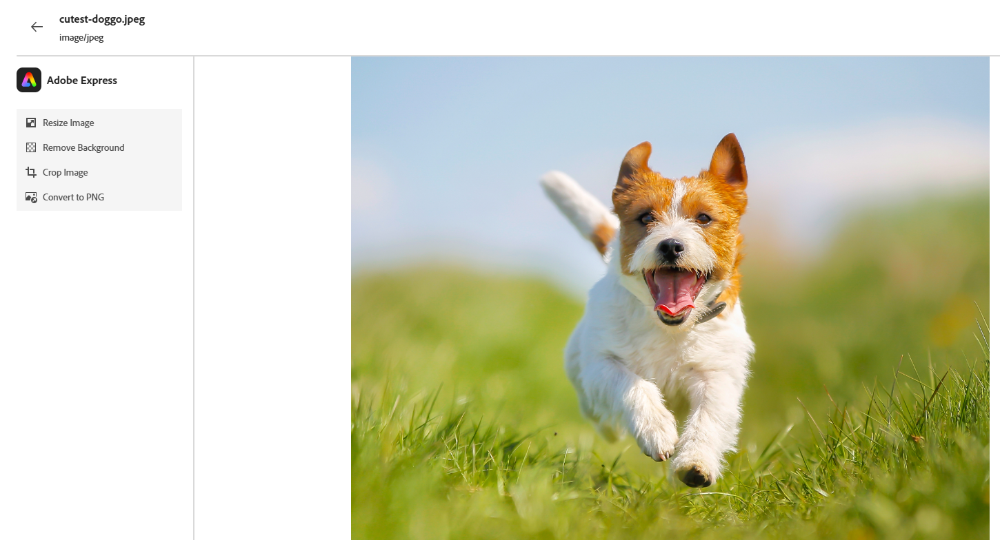

# Modifier des images à l’aide d’Adobe Express {#edit-images-with-adobe-express}

Adobe Marketo Engage s’intègre de manière native à Adobe Express, ce qui vous donne accès à divers outils d’édition d’images. Vous pouvez utiliser ces outils pour modifier vos images dans Marketo Engage Design Studio. L’intégration offre les principaux avantages suivants :

* Réutilisation accrue du contenu grâce à la modification et à l’enregistrement de nouvelles images dans Marketo Engage.

* Réduction du temps et des efforts nécessaires pour mettre à jour les images ou créer de nouvelles versions d’images existantes.

>[!NOTE]
>
>Actuellement, Adobe Express ne prend en charge que les formats de fichiers image PNG et JPEG.

## Accès à l’éditeur Adobe Express {#access-the-adobe-express-editor}

Il existe deux manières d’accéder à l’éditeur Adobe Express.

>[!BEGINTABS]

>[!TAB Cliquez sur le nom de l’image]

1. Dans Marketo Engage, accédez à **[!UICONTROL Design Studio]** et sélectionnez **[!UICONTROL Images et fichiers]**.

   {width="600" zoomable="yes"}

1. Sélectionnez l’image à modifier.

   {width="600" zoomable="yes"}

   >[!NOTE]
   >
   >* Pour afficher les ressources par espace de travail et par dossier, ouvrez la structure en cliquant sur l’icône **[!UICONTROL Afficher les dossiers]** en haut à gauche.
   >
   >* Pour trier le tableau en fonction de l’une des colonnes, cliquez sur le titre de la colonne. La flèche située dans la ligne de titre indique la colonne de tri et l’ordre actuels.

1. Dans l&#39;onglet image _Détails_, cliquez sur **[!UICONTROL Modifier dans Adobe Express]**.

   {width="600" zoomable="yes"}

   >[!CAUTION]
   >
   >Si l’image est déjà référencée dans un e-mail ou un modèle d’e-mail, toutes les modifications apportées mettront à jour cette image partout où elle est actuellement utilisée.

>[!TAB Actions sur les images et les fichiers]

1. Dans Marketo Engage, accédez à **[!UICONTROL Design Studio]** et sélectionnez **[!UICONTROL Images et fichiers]**.

   {width="600" zoomable="yes"}

   >[!NOTE]
   >
   >* Pour afficher les ressources par espace de travail et par dossier, ouvrez la structure en cliquant sur l’icône **[!UICONTROL Afficher les dossiers]** en haut à gauche.
   >
   >* Pour trier le tableau en fonction de l’une des colonnes, cliquez sur le titre de la colonne. La flèche située dans la ligne de titre indique la colonne de tri et l’ordre actuels.

1. Cochez la case en regard de l’image à modifier. Dans la liste déroulante **[!UICONTROL Actions relatives aux images et aux fichiers]**, sélectionnez **[!UICONTROL Modifier dans Adobe Express]**.

   {width="600" zoomable="yes"}

   >[!CAUTION]
   >
   >Si l’image est déjà référencée dans un e-mail ou un modèle d’e-mail, toutes les modifications apportées mettront à jour cette image partout où elle est actuellement utilisée.

>[!ENDTABS]

## Licence Adobe Express Enterprise {#adobe-express-enterprise-license}

### Utilisateurs disposant d’une licence d’entreprise {#users-with-an-enterprise-license}

Si vous disposez d’une licence Entreprise pour Adobe Express, vous avez accès à l’éditeur Express complet. Vous pouvez ajuster les paramètres d’image tels que la couleur, la luminosité, la netteté, le contraste, la taille, etc. L’option Magie de l’IA vous permet de supprimer des arrière-plans, d’insérer et de supprimer des objets, ainsi que d’effacer des parties d’une image.

>[!IMPORTANT]
>
>La licence achetée doit être sous la même organisation IMS que votre abonnement Marketo Engage pour accéder à toutes les fonctionnalités d’édition d’Adobe Express. En outre, chaque utilisateur doit disposer d’une licence dans Adobe Express. Les utilisateurs [sans licence](#users-without-an-enterprise-license) ne peuvent accéder qu’aux actions rapides dans Adobe Express.

### Utilisateurs sans licence d’entreprise {#users-without-an-enterprise-license}

Pour ceux qui ne disposent pas d’une licence Enterprise, vous avez toujours accès à plusieurs fonctionnalités d’édition d’action rapide. Ces fonctionnalités sont les suivantes :

* [Redimensionner l’image](#resize-image)
* [Supprimer l’arrière-plan](#remove-background)
* [Recadrer l’image](#crop-image)
* [Convertir en PNG/JPEG](#convert-to-png-jpeg)

Les fonctionnalités sont accessibles dans la partie gauche de la page de l’image.

{width="800" zoomable="yes"}

#### Redimensionner l’image {#resize-image}

1. Cliquez sur **Redimensionner l’image**.

1. Apportez les modifications souhaitées et cliquez sur **Appliquer** lorsque vous avez terminé.

{width="800" zoomable="yes"}

<table><tbody>
  <tr>
    <td style="width:25%"><b>Format</b></td>
    <td>Dans le menu déroulant <b>Format</b>, choisissez <b>Standard</b> à VIDE ou <b>Personnalisé</b> pour définir votre propre largeur/hauteur.</td>
  </tr>
  <tr>
    <td style="width:25%"><b>Largeur et Hauteur</b></td>
    <td>Par défaut, les proportions sont verrouillées, ce qui conserve les proportions de l’image identiques lorsque vous ajustez sa taille. Si vous le souhaitez, vous pouvez sélectionner le bouton de verrouillage pour déverrouiller les proportions.</td>
  </tr>
  <tr>
    <td style="width:25%"><b>Réinitialiser</b></td>
    <td>Cliquez sur <b>Réinitialiser</b> pour supprimer toutes les modifications apportées à l’image et la rétablir à son état d’origine.</td>
  </tr>
  <tr>
    <td style="width:25%"><b>Zoom et recadrage</b></td>
    <td>Cliquez sur <b>Zoom et recadrage</b> pour effectuer un zoom avant sur des zones spécifiques de l’image. Cliquez sur <b>Appliquer</b> après avoir effectué un zoom, pour rogner l’image sur ce qui s’affiche actuellement.</td>
  </tr>
</tbody>
</table>

#### Supprimer l’arrière-plan {#remove-background}

1. Cliquez sur **Supprimer l’arrière-plan**.

1. Adobe Express affiche l’image sans arrière-plan. S&#39;il répond à vos besoins, cliquez sur **Appliquer**.

{width="800" zoomable="yes"}

>[!TIP]
>
>Pour restaurer l’arrière-plan, sélectionnez l’image et sélectionnez à nouveau **Supprimer l’arrière-plan**.

#### Recadrer l’image {#crop-image}

1. Cliquez sur **[!UICONTROL Recadrer l’image]**.

1. Faites glisser les coins de l’image pour créer le recadrage souhaité.

{width="800" zoomable="yes"}

1. Cliquez sur **[!UICONTROL Appliquer]** lorsque vous avez terminé.

#### Convertir en PNG/JPEG {#convert-to-png-jpeg}

Convertissez un fichier PNG en fichier JPEG ou un fichier JPEG en fichier PNG.

1. Cliquez sur **[!UICONTROL Convertir en PNG/JPEG]**.

{width="800" zoomable="yes"}

1. Cliquez sur **[!UICONTROL Appliquer]**.

—RECADRER LES CHOSES EN DESSOUS—

Cliquez sur Recadrer l’image sur la page.

Dans l’éditeur d’Adobe Express, effectuez un recadrage de l’image et cliquez sur Enregistrer.

Remarque : cette action ne remplace pas l’image, mais vous présente l’image pour d’autres modifications.

Vous pouvez effectuer une mise à jour supplémentaire à l’aide d’une autre option du panneau de gauche, cliquer sur Enregistrer pour remplacer l’image existante, ou sur Enregistrer en tant que nouvelle ressource pour enregistrer en tant que nouvelle image.

Cliquez sur Enregistrer pour terminer l’action.

## Enregistrer votre travail {#save-your-work}

Une fois toutes vos modifications terminées, cliquez sur Enregistrer pour enregistrer votre travail.

CAPTURE D’ÉCRAN

L’image modifiée est enregistrée dans le même dossier que l’image d’origine.
