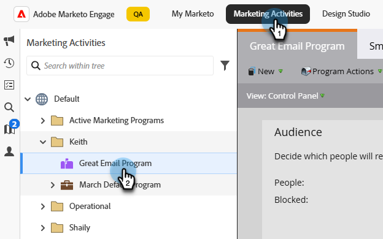

# Création d’e-mails {#email-authoring}

Découvrez comment créer, personnaliser et prévisualiser des e-mails dans le nouveau Designer d’e-mail de Marketo Engage.

>[!PREREQUISITES]
>
>Pour accéder au nouveau concepteur d’e-mail, votre abonnement à Marketo Engage doit être migré vers [Adobe Identity Management System (IMS)](https://experienceleague.adobe.com/fr/docs/marketo/using/product-docs/administration/marketo-with-adobe-identity/adobe-identity-management-overview). Si le vôtre n’a pas encore été envoyé et que vous souhaitez qu’il soit traité rapidement, veuillez contacter l’équipe du compte Adobe (votre gestionnaire de compte) ou l’assistance de [Marketo](https://nation.marketo.com/t5/support/ct-p/Support).

## Création d’un e-mail {#create-an-email}

Les e-mails du concepteur d’e-mail ne peuvent être créés que dans Design Studio et référencés dans les campagnes/listes intelligentes, ou créés/utilisés directement dans les programmes d’e-mail pour le moment.

>[!BEGINTABS]

>[!TAB  Design Studio ]

1. Connectez-vous à Marketo Engage via [Adobe Experience Cloud](https://experiencecloud.adobe.com/){target="_blank"}.

1. Dans Mon Marketo, sélectionnez **Design Studio**.

   

1. Dans l’arborescence, sélectionnez **E-mails (nouvel éditeur)**.

   

1. Cliquez sur le bouton **Créer un e-mail**.

   

1. Saisissez un nom d’e-mail et une ligne d’objet. Cliquez sur **Créer**.

   

>[!TAB Programme e-mail]

1. Connectez-vous à Marketo Engage via [Adobe Experience Cloud](https://experiencecloud.adobe.com/){target="_blank"}.

1. Recherchez et sélectionnez (ou créez) votre programme de messagerie.

   

1. Vous disposez de deux options pour créer un e-mail. Cliquez avec le bouton droit sur le nom de votre programme de messagerie et sélectionnez **Nouvelle ressource locale**, ou cliquez sur le bouton **+Nouvel e-mail** dans la zone E-mail du tableau de bord. Dans cet exemple, nous allons effectuer la première.

   

1. Sélectionnez **E-mail (nouvel éditeur)**.

   

1. Saisissez un nom d’e-mail et une ligne d’objet. Cliquez sur **Créer**.

   

>[!ENDTABS]

C&#39;est ça. Il est maintenant temps de concevoir votre e-mail.

## Choisir votre type de contenu {#choose-your-content-type}

1. Dans l’e-mail que vous venez de créer, cliquez sur **Ajouter du contenu d’e-mail**.

   

1. La page _Créer votre e-mail_ se charge. Plusieurs options s’offrent à vous :

* [Concevoir en partant de zéro](#design-from-scratch) à l’aide de l’éditeur visuel d’email

* [Importer votre propre HTML](#import-html) via un fichier HTML ou zip

* [Sélectionnez un modèle existant](#choose-a-template) (un de nos exemples ou un que vous avez déjà enregistré)

### Créer en partant de zéro {#design-from-scratch}

Lorsque vous commencez à partir de zéro dans l’éditeur d’e-mail, utilisez les options ci-dessous pour définir votre contenu.

1. Sur la page _Créer votre e-mail_, sélectionnez **Créer en partant de zéro**.

1. Ajoutez [structure et contenu](#add-structure-and-content) à votre e-mail.

1. Ajoutez [images](#add-assets).

1. [Personnalisez](#personalize-content) votre contenu.

1. Consulter les liens et [modifier le suivi](#edit-url-tracking).

### Importer du contenu HTML {#import-html}

Vous pouvez importer du contenu HTML existant pour concevoir votre e-mail. Le contenu peut être :

* Fichier HTML avec feuille de style incorporée

* Fichier .zip contenant un fichier HTML, la feuille de style (.css) et les images.

>[!NOTE]
>
>Il n’existe aucune contrainte sur la structure des fichiers .zip. Cependant, les références doivent être relatives et s’ajuster à l’arborescence du dossier .zip.

1. Sur la page Concevoir votre modèle , sélectionnez **Importer HTML**.

1. Effectuez un glisser-déposer du fichier HTML ou .zip souhaité (ou sélectionnez un fichier sur votre ordinateur), puis cliquez sur **Importer**.

   

>[!NOTE]
>
>Lorsque le contenu HTML est chargé, votre contenu se trouve en mode de compatibilité. Dans ce mode, vous pouvez uniquement personnaliser votre texte, ajouter des liens ou ajouter des ressources à votre contenu.

Vous pouvez apporter les modifications souhaitées au contenu importé à l’aide des outils [éditeur visuel d’e-mail](#add-structure-and-content).

### Choisir un modèle {#choose-a-template}

Vous avez le choix entre deux types de modèles.

* **Exemples de modèles** : Marketo Engage propose quatre modèles d’e-mail prêts à l’emploi.

* **Modèles enregistrés** : il s’agit de modèles que vous avez créés à partir de zéro à l’aide du menu Modèles , ou d’un e-mail que vous avez créé et que vous avez choisi d’enregistrer en tant que modèle.

>[!BEGINTABS]

>[!TAB Exemples de modèles]

Choisissez l’un des modèles prêts à l’emploi pour prendre un bon départ dans la conception de votre modèle d’e-mail.

1. L’onglet Exemples de modèles est ouvert par défaut.

1. Sélectionnez le modèle que vous souhaitez utiliser.

   

1. Cliquez sur **Utiliser ce modèle**.

   

1. Modifiez le contenu selon vos besoins à l’aide du concepteur de contenu visuel.

>[!TAB Modèles enregistrés]

1. Cliquez sur l’onglet **Modèles enregistrés** et sélectionnez le modèle souhaité.

   

1. Cliquez sur **Utiliser ce modèle**.

   

1. Modifiez le contenu selon vos besoins à l’aide du concepteur de contenu visuel.

>[!ENDTABS]

## Ajouter la structure et le contenu {#add-structure-and-content}

1. Pour commencer à créer ou modifier du contenu, faites glisser et déposez un élément de Structures sur la zone de travail. Modifiez ses paramètres dans le volet de droite.

   >[!TIP]
   >
   >Sélectionnez le composant n:n colonne pour définir le nombre de colonnes de votre choix (entre trois et 10). Vous pouvez également définir la largeur de chaque colonne en déplaçant les flèches situées sous celle-ci.

   

   >[!NOTE]
   >
   >La taille de chaque colonne ne peut pas être inférieure à 10 % de la largeur totale du composant de structure. Seules les colonnes vides peuvent être supprimées.

1. Dans la section Contenu , faites glisser les éléments de votre choix et déposez-les dans un ou plusieurs composants de structure.

   

1. Chaque composant peut être personnalisé via les onglets Paramètres ou Style . Modifiez la police, le style de texte, la marge, etc.

### Ajouter des fragments {#add-fragments}

1. Pour accéder à vos fragments, sélectionnez l’icône _Fragments_ (  ) dans le volet de navigation de gauche.

   {width="700" zoomable="yes"}

1. Faites glisser et déposez l’un des fragments dans l’espace réservé du composant structurel.

L’éditeur effectue le rendu du fragment dans la section/l’élément de la structure de l’e-mail. Le contenu du fragment est mis à jour dynamiquement dans la structure pour afficher le contenu tel qu’il apparaît dans l’e-mail.

>[!TIP]
>
>Si vous souhaitez que le fragment occupe toute la disposition horizontale de l’e-mail, ajoutez une structure de colonnes 1:1, puis faites-y glisser le fragment et déposez-le.

Une fois l’e-mail enregistré, il apparaît dans l’onglet _[!UICONTROL Utilisé par]_ de la page des détails du fragment. Les fragments ajoutés à un modèle d’e-mail ne sont pas modifiables dans le modèle ; le fragment source définit le contenu.

### Ajout d’Assets {#add-assets}

Ajoutez les images stockées dans la section [Images et fichiers](/help/marketo/product-docs/demand-generation/images-and-files/add-images-and-files-to-marketo.md){target="_blank"} de votre instance Marketo Engage.

>[!NOTE]
>
>Vous pouvez uniquement ajouter des images dans le nouveau concepteur, mais aucun autre type de fichier pour le moment.

1. Pour accéder à vos images, cliquez sur l’icône Sélecteur de ressources .

   

1. Faites glisser et déposez l’image souhaitée dans un composant de structure.

   

   >[!NOTE]
   >
   >Pour remplacer une image existante, sélectionnez-la, puis cliquez sur **Sélectionner une ressource** dans l’onglet Paramètres à droite.

### Calques, paramètres et styles {#layers-settings-styles}

Ouvrez l’arborescence de navigation pour accéder à des structures spécifiques et à leurs colonnes/composants en vue d’une modification plus granulaire. Pour y accéder, cliquez sur l’icône Arborescence de navigation .

L’exemple ci-dessous décrit les étapes à suivre pour ajuster la marge intérieure et l’alignement vertical à l’intérieur d’un composant de structure composé de colonnes.

1. Sélectionnez la colonne dans le composant de structure directement dans la zone de travail ou à l’aide de l’_arborescence de navigation_ affichée à gauche.

1. Dans la barre d’outils Colonne, cliquez sur l’outil _[!UICONTROL Sélectionner une colonne]_ et choisissez celle à modifier.

   Vous pouvez également le sélectionner dans l’arborescence de la structure. Les paramètres modifiables de cette colonne sont affichés dans les onglets _[!UICONTROL Paramètres]_ et _[!UICONTROL Styles]_ sur la droite.

   

1. Pour modifier les propriétés de la colonne, cliquez sur l’onglet _[!UICONTROL Styles]_ à droite et modifiez-les selon vos besoins :

   * Pour **[!UICONTROL Arrière-plan]**, modifiez la couleur d’arrière-plan si nécessaire.

     Décochez la case pour un arrière-plan transparent. Activez le paramètre **[!UICONTROL Image d’arrière-plan]** pour utiliser une image comme arrière-plan au lieu d’une couleur unie.

   * Pour **[!UICONTROL Alignement]**, sélectionnez l’icône _Haut_, _Milieu_ ou _Bas_.
   * Pour **[!UICONTROL Marge intérieure]**, définissez la marge intérieure pour tous les côtés.

     Sélectionnez **[!UICONTROL Marge intérieure différente pour chaque côté]** si vous souhaitez ajuster la marge intérieure. Cliquez sur l’icône _Verrouiller_ pour interrompre la synchronisation.

   * Développez la section **[!UICONTROL Avancé]** pour définir les styles intégrés de la colonne.

   

1. Répétez ces étapes selon les besoins pour ajuster l’alignement et la marge intérieure des autres colonnes du composant.

1. Enregistrez vos modifications.

### Personnaliser le contenu {#personalize-content}

Les jetons fonctionnent dans le nouvel éditeur de la même manière que dans l’ancien, mais l’icône a un aspect différent. L’exemple ci-dessous décrit l’ajout d’un jeton de prénom avec un texte de remplacement.

1. Sélectionnez le composant de texte. Placez le curseur à l’endroit où vous souhaitez que le jeton apparaisse, puis cliquez sur l’icône **Ajouter une personnalisation**.

   

1. Cliquez sur le [type de jeton](/help/marketo/product-docs/demand-generation/landing-pages/personalizing-landing-pages/tokens-overview.md){target="_blank"} souhaité.

   

1. Recherchez le jeton souhaité et cliquez sur l’icône **...** (cliquer sur l’icône + ajoute un jeton sans texte de remplacement).

   

   >[!NOTE]
   >
   >« Texte de remplacement » est le nouveau terme de l’éditeur pour la valeur par défaut. Exemple : ``{{lead.First Name:default=Friend}}``. Il est recommandé au cas où il n’y aurait aucune valeur pour la personne dans le champ que vous choisissez.

1. Définissez le texte de remplacement, puis cliquez sur **Ajouter**.

   

1. Cliquez sur **Enregistrer**.

### Modifier le tracking des URL {#edit-url-tracking}

Il arrive que vous ne souhaitiez pas activer l’URL de tracking Marketo sur un lien d’un e-mail. Cela s’avère utile lorsque la page de destination ne prend pas en charge les paramètres d’URL et peut entraîner la rupture d’un lien.

1. Cliquez sur l’icône Liens pour afficher toutes les URL de votre e-mail.

   

1. Cliquez sur l’icône en forme de crayon pour modifier le suivi de tous les liens souhaités.

1. Cliquez sur la liste déroulante **Type de tracking** et effectuez votre sélection.

   

   <table><tbody>
     <tr>
       <td><b>Suivi sans mkt_tok</b></td>
       <td>Active le tracking sur l’URL sans utiliser le paramètre de chaîne de requête mkt_tok dans l’URL de destination</td>
     </tr>
     <tr>
       <td><b>Suivi avec mkt_tok</b></td>
       <td>Active le tracking sur l’URL avec utilisation du paramètre de chaîne de requête mkt_tok dans l’URL de destination</td>
     </tr>
     <tr>
       <td><b>Ne pas suivre</b></td>
       <td>Désactive le tracking de l'URL</td>
     </tr>
   </tbody>
   </table>

1. Vous pouvez éventuellement attribuer un libellé à l’URL ou ajouter des balises.

1. Cliquez sur **Enregistrer** lorsque vous avez terminé.

## Vérifier les alertes {#check-alerts}

Lorsque vous concevez votre contenu, des alertes s’affichent en haut à droite de l’écran lorsque des paramètres clés sont manquants.

Il existe deux types d’alertes :

**Avertissements**

Les avertissements se rapportent aux recommandations et aux bonnes pratiques telles que :

* **Le lien d’exclusion ne figure pas dans le corps de l’e-mail** : bien que les liens de désabonnement soient obligatoires, il est recommandé de les ajouter au corps de votre e-mail.

>[!NOTE]
>
>L’ajout d’une option de désabonnement n’est pas nécessaire pour les [ e-mails opérationnels ](/help/marketo/product-docs/email-marketing/general/functions-in-the-editor/make-an-email-operational.md) (non marketing).

* **Version texte d’HTML vide** : vous devez définir une version texte du corps de votre e-mail pour les cas où le contenu d’HTML ne peut pas être affiché.

* **Lien vide figurant dans le corps de l’e-mail** : vérifiez que tous les liens de votre e-mail sont corrects.

* **La taille de l’e-mail a dépassé la limite de 100KB** : pour une diffusion optimale, veillez à ce que la taille de votre e-mail ne dépasse pas 100KB.

**Erreurs**

Les erreurs vous empêchent d’envoyer ou de tester l’e-mail jusqu’à ce qu’elles soient résolues :

* **Ligne d’objet manquante** : une ligne d’objet d’e-mail est requise.

* **La version e-mail du message est vide** : cette erreur se produit lorsque le contenu de l’e-mail n’a pas été configuré.

## Tester l’e-mail {#test-your-email}

Lorsque le contenu de votre message est défini, vous pouvez utiliser des profils de test pour le prévisualiser, envoyer des BAT et contrôler son rendu sur les clients de bureau, mobiles et web les plus courants. Si vous avez inséré du contenu personnalisé, vous pouvez vérifier son affichage dans le message à l’aide des données de profil de test.

Pour prévisualiser le contenu de votre e-mail, cliquez sur **Simuler du contenu**, puis ajoutez un profil de test pour vérifier votre message à l’aide des données de profil de test.

## Référencer un e-mail {#reference-an-email}

Les e-mails Designer sont accessibles dans les programmes E-mail, Engagement, Par défaut et Événement (à l’exception des programmes de webinaire interactif). Si vous avez créé votre e-mail dans Design Studio, il peut être référencé à partir de campagnes et/ou listes dynamiques comme vous le feriez avec tout autre e-mail.

* Référencez-le dans une liste dynamique en [suivant les étapes habituelles](/help/marketo/product-docs/core-marketo-concepts/smart-lists-and-static-lists/creating-a-smart-list/create-a-smart-list.md).

* Référencez-le dans une campagne dynamique en [en suivant les étapes habituelles](/help/marketo/product-docs/core-marketo-concepts/smart-campaigns/creating-a-smart-campaign/create-a-new-smart-campaign.md).

>[!NOTE]
>
>Seuls les emails enregistrés peuvent être référencés. Il n’existe aucun statut « approuvé » dans le nouveau concepteur d’e-mail.

>[!MORELIKETHIS]
>
>[Modèles d’e-mail](/help/marketo/product-docs/email-marketing/email-designer/email-template-authoring.md){target="_blank"} : découvrez comment créer, concevoir et accéder à un modèle d’e-mail dans le nouveau concepteur.
