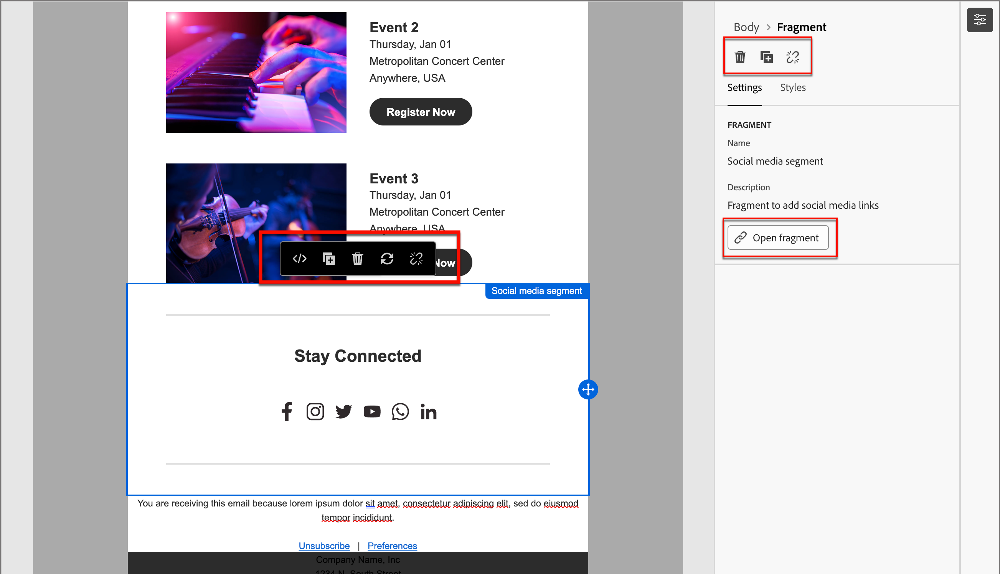

# Fragments

Un fragment est un composant réutilisable pouvant être référencé dans un ou plusieurs e-mails et modèles d’e-mail. Il s’agit généralement d’un bloc de contenu (texte, image ou les deux) qui peut être rapidement inséré dans votre projet. Grâce à cette fonctionnalité, vous pouvez précréer plusieurs blocs de contenu personnalisés pour assembler le contenu des e-mails afin d’améliorer le processus de conception. Les cas d’utilisation courants incluent les blocs de contenu d’en-tête/de pied de page pour les e-mails, les bannières d’invitation d’événement, les messages saisonniers, etc.

>[!NOTE]
>
>Les fragments sont l’équivalent de [Fragments de code](/help/marketo/product-docs/personalization/segmentation-and-snippets/snippets/create-a-snippet.md){target="_blank"} dans l’ancien éditeur d’e-mail.

Pour tirer le meilleur parti des fragments dans vos workflows :

* _Créer des fragments_ - Créez des fragments visuels, en partant de zéro ou en enregistrant du contenu en tant que fragment à partir de l’éditeur de contenu visuel.
* _Réutiliser des fragments_ - Utilisez-les autant de fois que nécessaire dans votre contenu.

## Fragments visuels {#visual-fragments}

Les fragments visuels sont des blocs visuels prédéfinis créés (à l’aide de l’éditeur visuel de contenu) que vous pouvez réutiliser dans plusieurs e-mails ou modèles d’e-mail.

## Accéder aux fragments et les gérer {#access-and-manage-fragments}

Pour accéder aux fragments visuels, accédez au **Design Studio** dans Marketo Engage. Dans l’arborescence de gauche, cliquez sur **[!UICONTROL Fragments (nouveaux)]**.

{width="600" zoomable="yes"}

Par défaut, le tableau est trié selon la colonne _[!UICONTROL Modifié]_. Cliquez sur d’autres titres de colonne pour modifier les critères de tri du tableau. Cliquez à nouveau sur le même titre pour basculer entre ordre croissant et décroissant.

### Rechercher et filtrer

Utilisez la barre de recherche pour rechercher un fragment par nom. Cliquez sur l’icône _Filtre_ (  ) pour afficher les options de filtre disponibles et choisir les paramètres souhaités.

{width="700" zoomable="yes"}

### Personnaliser les colonnes {#customize-the-column-display}

Personnalisez les colonnes à afficher dans le tableau en cliquant sur l’icône _Personnaliser le tableau_ (  ) en haut à droite.

Sélectionnez les colonnes souhaitées et cliquez sur **[!UICONTROL Appliquer]**.

{width="400" zoomable="yes"}

### Statut du fragment {#fragment-status}

Le statut du fragment détermine sa disponibilité pour une utilisation dans un e-mail ou un modèle d’e-mail et les modifications que vous pouvez y apporter.

<table>
<tbody>
  <tr>
    <td width="25%"><b>Brouillon</b></td>
    <td width="75%">Lorsque vous créez un fragment, il est à l’état de brouillon. Il reste en version préliminaire jusqu’à ce que vous le publiiez pour l’utiliser dans un e-mail ou un modèle d’e-mail.
    
Actions disponibles :
    <li>Modifier tous les détails</li>
    <li>Modifier dans le concepteur visuel</li>
    <li>Publier</li>
    <li>Dupliquer</li>
    <li>Supprimer</li>
  </td>
  <tr>
    <td><b>Publié</b></td>
    <td>Lorsque vous publiez un fragment, il peut être utilisé dans un e-mail ou un modèle d’e-mail. Le contenu du fragment publié ne peut pas être modifié dans le concepteur visuel.
    
Actions disponibles :
    <li>Modifier la description</li>
    <li>Ajouter à un e-mail ou un modèle</li>
    <li>Créer une version brouillon</li>
    <li>Dupliquer</li>
    <li>Supprimer (si non utilisé)</li>
    </td>
  </tr>
  <tr>
    <td style="width:25%"><b>Publié avec le brouillon</b></td>
    <td style="width:75%">Lorsque vous créez un brouillon à partir d’un fragment publié, la version publiée reste disponible pour une utilisation dans un e-mail ou un modèle d’e-mail, et le contenu du brouillon peut être modifié dans le concepteur visuel. Si vous publiez le brouillon, il remplace la version publiée actuelle et le contenu est mis à jour dans <i>tous</i> les e-mails et les modèles d’e-mail où il est utilisé.
    
Actions disponibles :
    <li>Modifier la description</li>
    <li>Ajouter à un e-mail ou un modèle</li>
    <li>Modifier le brouillon dans le concepteur visuel</li>
    <li>Publier le brouillon</li>
    <li>Dupliquer</li>
    <li>Supprimer (si non utilisé)</li>
    </td>
  </tr>
</tbody>
</table>

## Créer un fragment {#create-a-fragment}

1. Pour créer un fragment visuel, cliquez sur **[!UICONTROL Créer un fragment]** en haut à droite de la page de liste des fragments.

   {width="700" zoomable="yes"}

1. Donnez un **[!UICONTROL Nom]** et un **[!UICONTROL Description]** facultatif à votre fragment.

   _Exigences relatives aux fragments_

   * Nom : 100 caractères au maximum, doit être unique et ne pas respecter la casse
   * Description : 300 caractères max.
   * Caractères : alpha, numérique et caractères spéciaux sont autorisés
   * Les caractères réservés ne sont **_pas autorisés_** : `\ / : * ? " < > |`

   {width="400" zoomable="yes"}

1. Cliquez sur **[!UICONTROL Créer]**.

   {width="400" zoomable="yes"}

   >[!NOTE]
   >
   >Le **type** d’un fragment ne peut pas être modifié pour le moment.

1. Une boîte de dialogue modale _Créer votre e-mail_ s’affiche. Choisissez _Utiliser des thèmes_ ou _Style manuel_. Dans cette option, nous choisissons **Utiliser les thèmes**. Cliquez sur **Confirmer** lorsque vous avez terminé.

   

   >[!NOTE]
   >
   >Si vous choisissez le style manuel, utilisez les [&#x200B; outils de conception de contenu &#x200B;](/help/marketo/product-docs/email-marketing/email-designer/email-authoring.md#add-structure-and-content){target="_blank"} pour créer le contenu du fragment visuel.

1. Cliquez sur l’icône _Thèmes_.

   

   >[!INFO]
   >
   >En savoir plus sur les [paramètres de thème](/help/marketo/product-docs/email-marketing/email-designer/brand-themes.md#settings){target="_blank"}.

1. Cliquez sur **[!UICONTROL Enregistrer]** à tout moment pour enregistrer le brouillon de fragment.

1. Lorsque vous êtes prêt à rendre le fragment disponible pour une utilisation dans un e-mail ou un modèle d’e-mail, cliquez sur **[!UICONTROL Publier]**.

## Affichage des détails du fragment {#view-fragment-details}

Cliquez sur le nom d’un fragment de la page de liste pour ouvrir la page des détails du fragment. Vous pouvez choisir de modifier le fragment, de le renommer ou de mettre à jour sa description. Effectuez des mises à jour et cliquez en dehors du champ de nom ou de description pour enregistrer vos modifications.

>[!NOTE]
>
>Si un fragment publié est utilisé par un e-mail ou un modèle d’e-mail, vous ne pouvez pas modifier son nom ni le contenu. Vous pouvez créer un brouillon si vous souhaitez apporter des modifications au fragment.

{width="600" zoomable="yes"}

Cliquez sur **[!UICONTROL Modifier le fragment]** pour ouvrir le fragment dans l’éditeur de contenu visuel.

Quittez la vue à tout moment en cliquant sur la flèche _Précédent_ en haut à gauche, qui vous renvoie à la page de liste _Fragments_.

## Afficher les références du fragment utilisé par {#view-fragment-used-by-references}

Dans la page des détails du fragment, cliquez sur l’onglet **[!UICONTROL Utilisé par]** pour afficher les détails de l’utilisation du fragment dans Marketo Engage.

>[!IMPORTANT]
>
>Impossible de supprimer un fragment actuellement utilisé par un e-mail ou un modèle d’e-mail.

{width="600" zoomable="yes"}

Cliquez sur le lien pour ouvrir l’e-mail ou le modèle d’e-mail correspondant où le fragment est utilisé.

## Suppression de fragments {#delete-fragments}

Étant donné qu’un fragment actuellement utilisé par un e-mail ou un modèle d’e-mail ne peut pas être supprimé, assurez-vous de vérifier les références _utilisé par_ avant de procéder à la suppression d’un fragment. En outre, une suppression ne peut pas être annulée. Vérifiez-la avant de lancer une action de suppression.

Vous pouvez supprimer un fragment à l’aide de l’une des méthodes suivantes :

* Dans les détails du fragment sur la droite, cliquez sur **[!UICONTROL Supprimer]**.
* Dans la page de liste _[!UICONTROL Fragments]_, cliquez sur les points de suspension en regard du fragment et choisissez **[!UICONTROL Supprimer]**.

Cette action ouvre une boîte de dialogue de confirmation. Vous pouvez abandonner le processus en cliquant sur **[!UICONTROL Annuler]** ou sur **[!UICONTROL Supprimer]** pour confirmer la suppression.

{width="400"}

## Modifier des fragments {#edit-fragments}

Les modifications apportées à un fragment dépendent de son statut actuel :

* Lorsqu’un fragment a le statut _Brouillon_, vous pouvez modifier n’importe lequel de ses détails et le contenu visuel.
* Lorsqu’un fragment a le statut _Publié_, vous pouvez modifier sa description, mais pas son nom. Vous ne pouvez pas modifier le contenu visuel.
* Lorsqu’un fragment possède le statut _Publié avec brouillon_, la modification des détails se limite à la description. Vous pouvez également modifier le contenu visuel de la version brouillon.

>[!BEGINTABS]

>[!TAB Brouillon]

1. Dans la page de liste _[!UICONTROL Fragments]_, cliquez sur le nom du fragment pour l’ouvrir.

   Un aperçu du contenu visuel s’affiche avec les détails du fragment sur la droite.

1. Effectuez les modifications souhaitées.

   {width="600" zoomable="yes"}

1. Pour modifier le contenu dans le concepteur visuel, cliquez sur **[!UICONTROL Modifier le fragment]**. Cliquez sur **Enregistrer** lorsque vous avez terminé.

1. Cliquez sur **[!UICONTROL Enregistrer]** ou **[!UICONTROL Enregistrer et fermer]** pour revenir aux détails du fragment.

1. Lorsque vous souhaitez rendre le fragment disponible pour une utilisation dans un e-mail ou un modèle d’e-mail, cliquez sur **[!UICONTROL Publier]**.

>[!TAB Publié]

1. Dans la page de liste _[!UICONTROL Fragments]_, cliquez sur le nom du fragment pour l’ouvrir.

   Un aperçu du contenu visuel s’affiche avec les détails du fragment sur la droite.

1. Modifiez la description, si nécessaire.

   Pour un fragment publié, tous les autres détails ne peuvent pas être modifiés.

1. Si vous souhaitez mettre à jour le contenu, cliquez sur **[!UICONTROL Créer un brouillon]** en haut à droite.

   Cliquez sur **[!UICONTROL OK]** dans la boîte de dialogue pour ouvrir le brouillon dans le concepteur visuel. Vous pouvez changer le `image source` KG - LIEN ICI si nécessaire.

   {width="300"}

1. Cliquez sur **[!UICONTROL Enregistrer]** ou **[!UICONTROL Enregistrer et fermer]** pour revenir aux détails du fragment.

1. Lorsque vous souhaitez rendre le fragment disponible pour une utilisation dans un e-mail ou un modèle d’e-mail, cliquez sur **[!UICONTROL Publier]**.

>[!NOTE]
>
>Lorsque vous publiez le brouillon, il remplace la version publiée actuelle et le contenu est mis à jour dans les e-mails et les modèles d’e-mail où il est déjà utilisé.

>[!TAB Publié avec le brouillon]

Vous pouvez ouvrir le brouillon pour le modifier de deux manières différentes à partir de la page de liste _[!UICONTROL Fragments]_ :

* Cliquez sur l’icône _Plus_ (**...**) en regard du nom du fragment et choisissez **[!UICONTROL Ouvrir le brouillon]**.

  {width="300"}

* Cliquez sur le nom du fragment pour l’ouvrir. Cliquez ensuite sur **[!UICONTROL Ouvrir le brouillon]** en haut à droite.

Un aperçu du contenu visuel du brouillon s’affiche avec les détails du fragment à droite.

Pour mettre à jour le contenu :

1. Cliquez sur **[!UICONTROL Modifier le fragment]** en haut à droite. Cliquez sur **Enregistrer** lorsque vous avez terminé.

1. Cliquez sur **[!UICONTROL Enregistrer]** ou **[!UICONTROL Enregistrer et fermer]** pour revenir aux détails du fragment.

1. Lorsque vous souhaitez rendre le fragment disponible pour une utilisation dans un e-mail ou un modèle d’e-mail, cliquez sur **[!UICONTROL Publier]**.

>[!NOTE]
>
>Lorsque vous publiez le brouillon, il remplace la version publiée actuelle et le contenu est mis à jour dans les e-mails et les modèles d’e-mail où il est déjà utilisé.

>[!ENDTABS]

## Fragments dupliqués {#duplicate-fragments}

Vous pouvez dupliquer un fragment à l’aide de l’une des méthodes suivantes :

* Dans la page de liste _[!UICONTROL Fragments]_, cliquez sur l’icône _Plus_ (**...**) à côté du nom du fragment et sélectionnez **[!UICONTROL Dupliquer]**.
* En haut à droite de la page des détails du fragment, cliquez sur **[!UICONTROL ... En plus]** et choisissez **[!UICONTROL Dupliquer]**.

{width="600" zoomable="yes"}

Dans la boîte de dialogue, saisissez un nom unique et une description facultative. Cliquez sur **[!UICONTROL Dupliquer]**.

{width="400"}

Le fragment dupliqué apparaît ensuite dans la liste _Fragments_.

## Enregistrer un nouveau fragment d’un e-mail ou du contenu de modèle {#save-a-new-fragment-from-email-or-template-content}

Lorsque vous créez/modifiez un e-mail ou un modèle d’e-mail dans l’éditeur visuel de contenu, vous pouvez enregistrer tout ou partie du contenu en tant que fragment pour le réutiliser.

1. Pour enregistrer le contenu en tant que fragment, cliquez sur **[!UICONTROL Plus]** et choisissez **[!UICONTROL Enregistrer en tant que fragment]**.

1. Sélectionnez les différents éléments à inclure dans le fragment.

   Sélectionnez plusieurs structures en maintenant le bouton Maj ou Ctrl enfoncé.

   Vous pouvez uniquement sélectionner des structures adjacentes.

1. Une fois le contenu sélectionné, cliquez sur **[!UICONTROL Créer]** en haut à droite.

1. Dans la boîte de dialogue, saisissez un nom et une description facultative pour le fragment et cliquez sur **[!UICONTROL Créer]**.

Le fragment est ensuite affiché dans la page de liste _Fragments_ et peut être utilisé dans les e-mails et les modèles d’e-mail.

## Ajouter des fragments visuels au contenu de votre e-mail ou modèle {#add-visual-fragments-to-your-email-or-template-content}

Les fragments sont conçus pour être réutilisés. Vous pouvez en ajouter jusqu’à 30 dans un e-mail ou un modèle d’e-mail, et ils peuvent être imbriqués jusqu’à un seul niveau.

* [Ajouter un fragment à un e-mail](/help/marketo/product-docs/email-marketing/email-designer/email-authoring.md#add-fragments)

* [Ajouter un fragment à un modèle d’e-mail](/help/marketo/product-docs/email-marketing/email-designer/email-template-authoring.md#add-fragments)

Le contenu du fragment est mis à jour dynamiquement dans la structure pour rendre un visuel de la manière dont le contenu apparaît dans l’e-mail.

>[!TIP]
>
>Si vous souhaitez que le fragment occupe toute la disposition horizontale dans l’e-mail, ajoutez une structure de colonne [!UICONTROL 1:1] puis faites-y glisser le fragment et déposez-le.

Une fois le modèle d’e-mail enregistré, il apparaît dans la page des détails du fragment lorsque l’onglet _[!UICONTROL Utilisé par]_ est sélectionné. Les fragments ajoutés ne sont pas modifiables dans l’e-mail ou le modèle ; le fragment source publié définit le contenu.

## Actions sur les fragments lors de la création d’e-mails et de modèles {#fragment-actions-during-email-and-template-authoring}

Lorsqu’un fragment est ajouté à un e-mail ou à un modèle d’e-mail, son contenu ne peut pas être modifié dans l’e-mail ou le modèle. Vous pouvez toutefois appliquer les actions suivantes :

* **[!UICONTROL Supprimer]** - Supprime le fragment du contenu de l’e-mail ou du modèle d’e-mail actuel (la source du fragment n’est pas affectée).
* **[!UICONTROL Actualiser]** - Actualise le contenu du fragment dans l’e-mail ou le modèle d’e-mail actuel. L’actualisation est utile lorsque vous souhaitez refléter des modifications récentes apportées au fragment après l’ajout à l’e-mail ou au modèle d’e-mail.
* **[!UICONTROL Dupliquer]** - Duplique le fragment dans le même e-mail ou modèle d’e-mail dans l’éditeur. Le fragment dupliqué est ajouté juste en dessous de l’original.
* **[!UICONTROL Ouvrir le fragment]** - Un nouvel onglet de navigateur s’ouvre avec la page de l’éditeur de fragments et les détails.
* **[!UICONTROL Rompre l’héritage]** - Cela rompt l’héritage du fragment (et de ses modifications) de la source. Utilisez cette action pour rendre le contenu du fragment disponible en tant que contenu indépendant et modifiable dans l’e-mail ou le modèle d’e-mail. Cette action supprime également l’e-mail ou le modèle d’e-mail de la référence _Utilisé par_ pour le fragment d’origine.

Lorsque vous sélectionnez le fragment sur la page de l’éditeur, ces actions sont disponibles dans la barre d’outils contextuelle et le panneau des propriétés à droite.

{width="600" zoomable="yes"}

>[!MORELIKETHIS]
>
>[&#x200B; Fragments personnalisables &#x200B;](/help/marketo/product-docs/email-marketing/email-designer/customizable-fragments.md)
