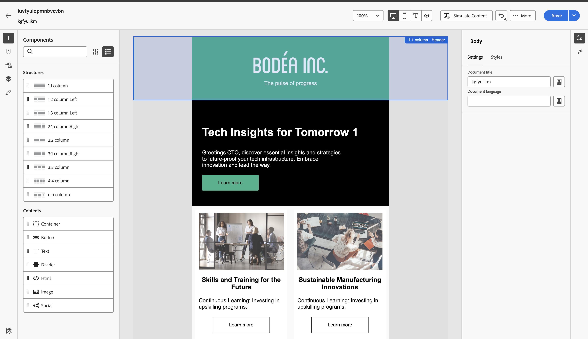

# Intégration de GenStudio pour Marketo Engage {#genstudio-integration-for-marketo-engage}

Adobe GenStudio for Performance Marketing est une application IA générative qui vous permet de créer vos propres annonces et e-mails afin de générer des campagnes marketing personnalisées et percutantes qui répondent aux normes de votre marque et sont conformes aux politiques de votre entreprise. Il propose un large éventail d’outils qui simplifient les complexités de la création de contenu.

>[!INFO]
>
>En savoir plus sur [GenStudio for Performance Marketing](https://experienceleague.adobe.com/fr/docs/genstudio-for-performance-marketing/user-guide/home){target="_blank"}.

## Tirer parti des fonctionnalités de GenStudio dans Marketo Engage {#leverage-genstudio-capabilities}

Grâce à cette intégration, un spécialiste du marketing technique qui utilise Marketo Engage pour développer et automatiser des campagnes par e-mail peut collaborer avec un spécialiste du marketing de performance qui crée du contenu à l’aide de GenStudio. Cela leur permet d’intégrer facilement du contenu de marque de GenStudio dans Marketo Engage.

## Exporter un modèle HTML de Marketo Engage vers GenStudio {#export-an-html-template}

Exportez facilement un modèle contenant les directives de votre marque vers GenStudio for Performance Marketing.

1. Dans Marketo Engage, accédez au contenu de votre e-mail.

1. Dans le Designer Email, cliquez sur le bouton **Plus** et sélectionnez **Exporter HTML**.

   

1. [Chargez le modèle exporté d’HTML](https://experienceleague.adobe.com/fr/docs/genstudio-for-performance-marketing/user-guide/content/templates/use-templates#templates-from-ajo-and-marketo){target="_blank"} dans GenStudio for Performance Marketing.

1. Dans GenStudio, utilisez ce modèle pour [créer plusieurs variations d’e-mail](https://experienceleague.adobe.com/fr/docs/genstudio-for-performance-marketing/user-guide/create/create-email-experience){target="_blank"} avec des invites d’IA et les enregistrer.

## Tirer parti des expériences GenStudio dans Marketo Engage {#leverage-genstudio-experiences}

Pour tirer parti des variations d’e-mail GenStudio que vous avez créées en les important dans Marketo Engage, procédez comme suit.

1. Dans Marketo Engage, [créez un email](/help/marketo/product-docs/email-marketing/email-designer/email-authoring.md#create-an-email).

1. Dans la page Détails de l’e-mail, cliquez sur **Modifier le contenu de l’e-mail**.

   

1. Sélectionnez **Importer HTML**.

   

1. Cliquez sur le bouton **Adobe GenStudio for Performance Marketing**.

   Bouton 

1. Parcourez les expériences GenStudio pour commencer à créer votre contenu. Vous pouvez filtrer les expériences selon des critères tels que les produits, les rôles, les marques ou même les couleurs.

1. Sélectionnez une expérience et cliquez sur **Utiliser**.

   {width="800" zoomable="yes"}

1. Le contenu sélectionné s’affiche dans le Concepteur d’e-mail.

   {width="800" zoomable="yes"}

>[!NOTE]
>
>Les expériences GenStudio créées à partir d’un modèle Marketo Engage sont importées directement dans le Designer Email. Les expériences GenStudio créées sans modèle Marketo Engage sont importées en mode de compatibilité.

Utilisez les [outils d’édition de contenu d’e-mail](/help/marketo/product-docs/email-marketing/email-designer/email-authoring.md#add-structure-and-content){target="_blank"} et [champs de personnalisation](/help/marketo/product-docs/email-marketing/email-designer/email-authoring.md#personalize-content){target="_blank"} pour modifier votre e-mail selon vos besoins.
