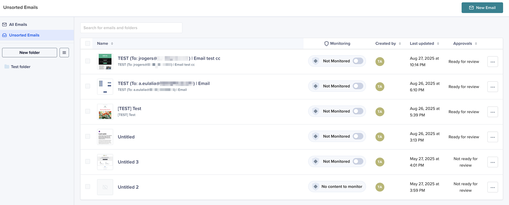

# Test du rendu des e-mails avec Litmus {#test-email-rendering-with-litmus}

Tirez parti de votre compte [Litmus](https://www.litmus.com/email-testing) dans Marketo Engage pour voir instantanément comment vos e-mails sont rendus dans les clients de messagerie populaires.

>[!AVAILABILITY]
>
>Cette fonctionnalité est disponible pour tous les utilisateurs de Marketo Engage qui disposent d’un compte Litmus actif.

## Utilisateurs Entreprise Litmus {#litmus-enterprise}

Les étapes suivantes s&#39;adressent aux utilisateurs du [Plan d&#39;entreprise Litmus](https://www.litmus.com/pricing/enterprise){target="_blank"}.

1. Sur l’écran _Modifier le contenu de l’e-mail_, cliquez sur le bouton **Simuler du contenu**.

   

1. Sélectionnez le destinataire du test et cliquez sur le bouton **Rendu de l’e-mail**.

   {width="800" zoomable="yes"}

1. Si ce n&#39;est pas déjà fait, **connectez votre compte Litmus**. Si vous l’avez déjà fait, passez à l’étape 6.

   {width="800" zoomable="yes"}

1. Saisissez vos identifiants Litmus et cliquez sur **Se connecter**.

   >[!IMPORTANT]
   >
   >Lors de la connexion de votre compte Litmus à Marketo Engage, vous acceptez que les e-mails de test soient envoyés à Litmus. Après l’envoi, ces e-mails de test ne sont plus gérés par Adobe. Ainsi, la politique e-mail de rétention des données de Litmus s’applique à ces e-mails, y compris les données de personnalisation qui peuvent y être incluses.

1. Cliquez sur **Connexion** pour terminer l’intégration.

   

1. Cliquez sur le bouton **Exécuter le test** pour générer des prévisualisations d&#39;e-mail.

1. Découvrez à quoi ressemble votre contenu dans les principaux clients de messagerie de bureau, mobiles et web. Cliquez sur autant de miniatures que vous le souhaitez pour l’aperçu.

   {width="800" zoomable="yes"}

   >[!NOTE]
   >
   >Découvrez comment [personnaliser votre liste de clients de messagerie par défaut](https://help.litmus.com/article/227-change-your-default-email-clients-list).

1. Une fois le test terminé, cliquez sur la flèche vers l’arrière dans le coin supérieur gauche pour revenir à l’écran _Simuler du contenu_.

   

**ÉTAPE FACULTATIVE** : Si vous décidez d&#39;apporter des modifications à votre e-mail, après avoir cliqué sur **Rendu de l&#39;e-mail** pour les afficher, veillez également à cliquer sur le bouton **Retester** dans le coin supérieur droit de l&#39;écran Litmus _Prévisualisations d&#39;e-mail_.

## Utilisateurs principaux de Litmus {#litmus-core}

Les étapes suivantes s&#39;adressent aux utilisateurs du [Plan principal Litmus](https://www.litmus.com/pricing/){target="_blank"}.

1. Dans votre compte Litmus, récupérez l’adresse e-mail de test en cliquant sur le bouton **Copier l’adresse de test** dans l’écran _Tester_.

   {width="800" zoomable="yes"}

1. Dans Marketo Engage, accédez à l’écran _Modifier le contenu de l’e-mail_ de l’e-mail souhaité, puis cliquez sur le bouton **Simuler le contenu**.

   {width="600" zoomable="yes"}

1. Sélectionnez vos destinataires de test et cliquez sur le bouton **Envoyer un BAT**.

   {width="800" zoomable="yes"}

1. Saisissez l’adresse e-mail Litmus que vous avez copiée à l’étape 1 et cliquez de nouveau sur **Envoyer le BAT**.

   

1. Vérifiez l&#39;e-mail dans votre compte Litmus (dans le dossier correspondant à l&#39;adresse e-mail que vous avez copiée à partir de Litmus).

   {width="800" zoomable="yes"}
