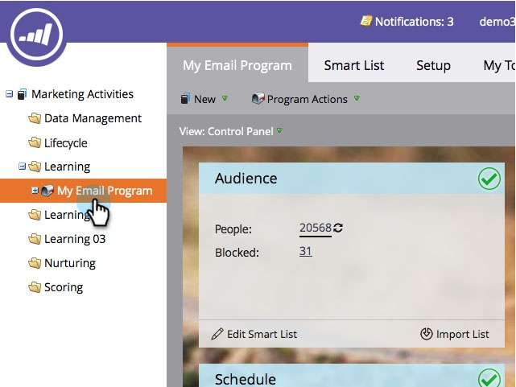

# Approbation/désapprobation d’un programme de messagerie {#approve-unapprove-an-email-program}

>[!PREREQUISITES]
>
>* [Créer un programme de messagerie](/help/marketo/product-docs/email-marketing/email-programs/creating-an-email-program/create-an-email-program.md)
>* [Définir une audience avec une liste dynamique](/help/marketo/product-docs/email-marketing/email-programs/managing-people-in-email-programs/define-an-audience-with-a-smart-list.md) ou [Définir une audience en important une liste](/help/marketo/product-docs/email-marketing/email-programs/managing-people-in-email-programs/define-an-audience-by-importing-a-list.md)
>
>* [Choisir un email existant](/help/marketo/product-docs/email-marketing/email-programs/email-program-actions/choose-an-existing-email.md) ou [Créer un email pour un programme d&#39;email](/help/marketo/product-docs/email-marketing/email-programs/email-program-actions/create-an-email-for-an-email-program.md)
>
>* [Planification de votre programme de messagerie](/help/marketo/product-docs/email-marketing/email-programs/email-program-actions/schedule-your-email-program.md)

## Approbation de votre programme de messagerie {#approve-your-email-program}

Maintenant que votre programme est prêt, la dernière étape est de l&#39;approuver. Voici comment :

1. Accédez à **Activités marketing**.

   

   Sélectionnez votre programme de messagerie.
   

   >[!CAUTION]
   >
   >Si vous n&#39;approuvez pas votre programme de messagerie, l&#39;email ne sera pas envoyé.

1. Sous la mosaïque **Approbation** , cliquez sur **Approuver le programme**.

   

1. Si nous trouvons des problèmes, nous vous le ferons savoir, corrigez-les et essayez à nouveau de les approuver.

   

   Parfait ! Vous avez fini. Votre email sortira à l&#39;heure planifiée.

   

## Désapprouver votre programme de messagerie {#unapprove-your-email-program}

Si vous changez d&#39;avis et décidez que vous ne voulez pas qu&#39;il sorte, vous pouvez annuler l&#39;approbation du programme de messagerie.

1. Accédez à **Activités marketing**.

   

1. Sélectionnez votre programme de messagerie.

   

1. Sous la mosaïque **Approbation**, cliquez simplement sur **Ne plus approuver le programme**.

   

C&#39;est fait ! Votre email ne sortira pas tant que vous ne l&#39;aurez pas approuvé à nouveau.
