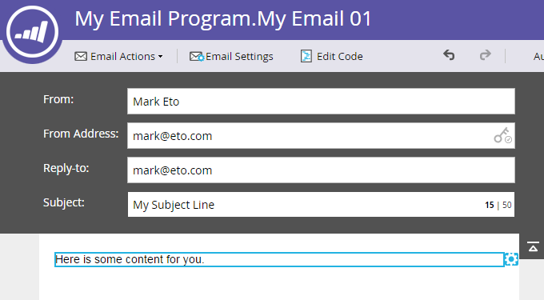

# Création d’un e-mail pour un programme de messagerie {#create-an-email-for-an-email-program}

>[!PREREQUISITES]
>
>* [Créer un programme de messagerie](/help/marketo/product-docs/email-marketing/email-programs/creating-an-email-program/create-an-email-program.md)
>* [Définir une audience avec une liste dynamique](/help/marketo/product-docs/email-marketing/email-programs/managing-people-in-email-programs/define-an-audience-with-a-smart-list.md) ou [Définir une audience en important une liste](/help/marketo/product-docs/email-marketing/email-programs/managing-people-in-email-programs/define-an-audience-by-importing-a-list.md)

Une fois que vous avez créé votre programme de messagerie et défini votre audience, vous souhaiterez décider de l’e-mail que vous envoyez. Vous pouvez [choisir un e-mail existant](/help/marketo/product-docs/email-marketing/email-programs/email-program-actions/choose-an-existing-email.md) ou en créer un à partir de zéro. Voici comment créer un e-mail.

1. Accédez à **[!UICONTROL Activités marketing]**.

   

1. Sélectionnez votre programme de messagerie. Sous le volet **[!UICONTROL E-mail]**, cliquez sur **[!UICONTROL Nouvel e-mail]**.

   

1. Saisissez un **[!UICONTROL Nom]**, sélectionnez le modèle de votre choix et cliquez sur **[!UICONTROL Créer]**.

   

1. Apportez toutes les modifications souhaitées et fermez l’éditeur.

   

   >[!NOTE]
   >
   >Découvrez comment [modifier des éléments dans un email](/help/marketo/product-docs/email-marketing/general/email-editor-2/edit-elements-in-an-email.md).

1. N’oubliez pas d’approuver votre e-mail.

   

Fantastique ! Maintenant que nous avons créé un e-mail à envoyer, nous allons [ajouter un test A/B](/help/marketo/product-docs/email-marketing/email-programs/email-program-actions/email-test-a-b-test/add-an-a-b-test.md) ou passer directement à [planification de votre programme de messagerie](/help/marketo/product-docs/email-marketing/email-programs/email-program-actions/schedule-your-email-program.md).
