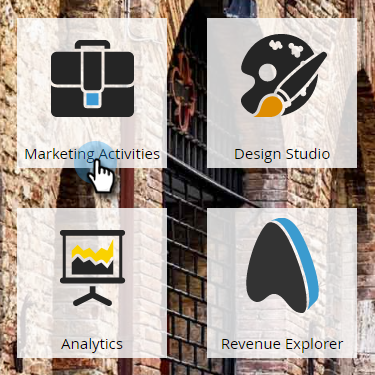

# Création d’un courrier électronique pour un programme de courrier électronique {#create-an-email-for-an-email-program}

>[!PREREQUISITES]
>
>* [Créer un programme de messagerie](/help/marketo/product-docs/email-marketing/email-programs/creating-an-email-program/create-an-email-program.md)
>* [Définir une audience avec une liste dynamique](/help/marketo/product-docs/email-marketing/email-programs/managing-people-in-email-programs/define-an-audience-with-a-smart-list.md) ou [Définir une audience en important une liste](/help/marketo/product-docs/email-marketing/email-programs/managing-people-in-email-programs/define-an-audience-by-importing-a-list.md)

Une fois que vous avez créé votre programme d&#39;email et défini votre audience, vous allez décider de l&#39;email que vous envoyez. Vous pouvez [choisir un email existant](/help/marketo/product-docs/email-marketing/email-programs/email-program-actions/choose-an-existing-email.md) ou en créer un de A à Z. Voici comment créer un email.

1. Accédez à **Activités marketing**.

   

1. Sélectionnez votre programme de messagerie. Sous la mosaïque **Email**, cliquez sur **Nouveau courrier électronique**.

   

1. Saisissez un **Nom**, sélectionnez le modèle de votre choix et cliquez sur **Créer**.

   

1. Apportez toutes les modifications souhaitées et fermez l’éditeur.

   

   >[!NOTE]
   >
   >Découvrez comment [modifier des éléments dans un email](/help/marketo/product-docs/email-marketing/general/email-editor-2/edit-elements-in-an-email.md).

1. N&#39;oubliez pas d&#39;approuver votre email.

   

Fantastique ! Maintenant que nous avons créé un email que nous voulons envoyer, [ajoutons un test A/B](/help/marketo/product-docs/email-marketing/email-programs/email-program-actions/email-test-a-b-test/add-an-a-b-test.md) ou passez directement à [la planification de votre programme de messagerie](/help/marketo/product-docs/email-marketing/email-programs/email-program-actions/schedule-your-email-program.md).
