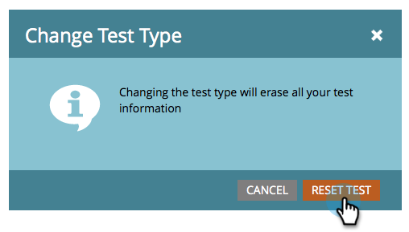

# Utiliser le test A/B &quot;From Address&quot; {#use-from-address-a-b-testing}

Vous pouvez facilement tester vos e-mails A/B. Un test intéressant est le test **De l&#39;adresse** . Voici comment le configurer.

>[!PREREQUISITES]
>
>* [Ajouter un test A/B](add-an-a-b-test.md)

>

1. Sous la mosaïque **Courrier électronique** , avec votre message électronique sélectionné, cliquez sur **Ajouter le test** A/B.

   

1. Une nouvelle fenêtre s’ouvre, sélectionnez **De l’adresse** pour le type **de** test.

   

1. Si vous disposez d’informations de test précédentes (comme un test d’objet), vous pouvez cliquer en toute sécurité sur **Réinitialiser le test**.

   

1. Entrez la deuxième information **de l&#39;adresse** de départ que vous souhaitez tester.

   >[!NOTE]
   >
   >Le choix A prérempli les informations contenues dans le courriel sélectionné.

   

   >[!TIP]
   >
   >Vous pouvez cliquer sur le signe **** plus pour ajouter autant d&#39;adresses de départ que vous le souhaitez.

1. Utilisez le curseur pour choisir le pourcentage d’audience que vous souhaitez dans votre test A/B, puis cliquez sur **Suivant**.

   

   >[!NOTE]
   >
   >Les différentes variations seront envoyées à des portions égales de la taille d&#39;échantillon de test choisie.

   >[!CAUTION]
   >
   >**Nous vous recommandons d’éviter de définir la taille de l’échantillon à 100%**. Si vous utilisez une liste statique, la définition de la taille de l’échantillon à 100 % envoie le courriel à tous les membres de l’audience et le gagnant n’est envoyé à personne. Si vous utilisez une liste **intelligente** , la définition de la taille de l’échantillon à 100 % envoie le courriel à tous les membres de l’audience *à ce moment-là. *Lorsque le programme de messagerie s’exécute à nouveau à une date ultérieure, toute nouvelle personne remplissant les conditions requises pour la liste intelligente recevra également le courrier électronique puisqu’elle est désormais incluse dans l’audience.

   OK, nous sommes presque là. Maintenant, nous devons [définir les critères](define-the-a-b-test-winner-criteria.md)de gagnant du test A/B.

   >[!NOTE]
   >
   >**Articles connexes**
   >
   >    
   >    
   >    * [Définition des critères de gagnant de test A/B](define-the-a-b-test-winner-criteria.md)

