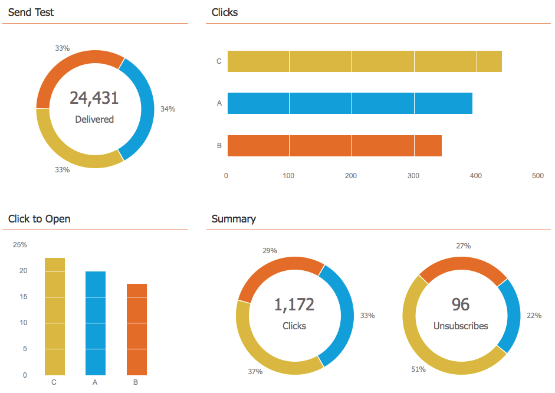
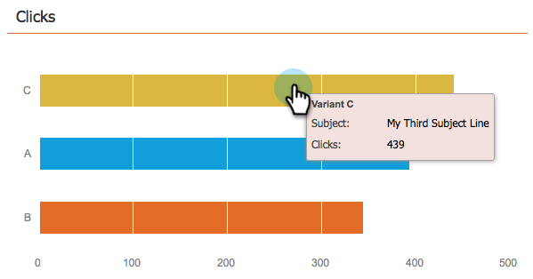

# Utiliser le tableau de bord du programme d’e-mail - Vue du test A/B {#use-the-email-program-dashboard-a-b-test-view}

Découvrez les performances de votre [test A/B de programme de messagerie](/help/marketo/product-docs/email-marketing/email-programs/email-program-actions/email-test-a-b-test/add-an-a-b-test.md) avec ce tableau de bord.

## Envoyer test {#send-test}

Vous pouvez voir ici le total diffusé et les répartitions par variantes.

## Clics {#clicks}

Vous pouvez voir ici le nombre de clics de chaque variante.

## Clic pour ouverture {#click-to-open}

Ce graphique montre le taux de clics à l’ouverture. (# clics / # ouvertures).

## Résumé {#summary}

Vous trouverez ici une répartition des clics et des désabonnements par variantes pour faciliter la comparaison.

Un tableau de bord sympa, non ?

>[!MORELIKETHIS]
>
>[Utiliser le tableau de bord du programme de messagerie](/help/marketo/product-docs/email-marketing/email-programs/email-program-data/use-the-email-program-dashboard.md)
