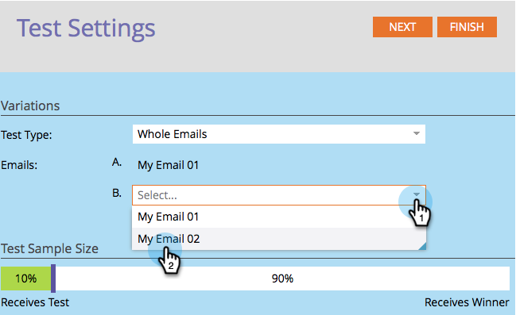

# Utiliser le test A/B &quot;Courrier électronique complet&quot; {#use-whole-email-a-b-testing}

Vous pouvez facilement tester vos e-mails A/B. Un bon test est le test **Entier le courriel** . Voici comment le configurer.

>[!NOTE]
>
>**Conditions préalables**
>
>* [Ajouter un test A/B](add-an-a-b-test.md)

>

1. Sous la mosaïque Courriel, avec votre adresse électronique sélectionnée, cliquez sur Ajouter le test A/B.

` 

`

1. Une nouvelle fenêtre s&#39;ouvre. Cliquez sur la liste déroulante Type **de** test et sélectionnez Courriels **** entiers.

   

1. Si vous disposez d’informations de test précédentes (comme un test d’objet), vous pouvez cliquer en toute sécurité sur **Réinitialiser le test**.

   

1. Sélectionnez votre premier courriel.

   

1. Cliquez sur **Ajouter** pour appliquer le courriel.

   ` 

   `

   >[!TIP]
   >
   >Vous pouvez ajouter plusieurs courriers électroniques. Cependant, si vous en ajoutez trop, cela peut ralentir le processus de test.

1. Sélectionnez votre deuxième adresse électronique.

   ` 

   `

1. Cliquez sur **Ajouter** pour appliquer le deuxième courriel. Faites glisser le curseur pour choisir le pourcentage de l’audience à recevoir pour le test A/B, puis cliquez sur **Suivant**.

   ` 

   `

   >[!NOTE]
   >
   >Les différentes variations seront envoyées à des portions égales de la taille **de l&#39;échantillon de** test choisi.

   >[!CAUTION]
   >
   >**Nous vous recommandons d’éviter de définir la taille de l’échantillon à 100%**. Si vous utilisez une liste statique, la définition de la taille de l’échantillon à 100 % envoie le courriel à tous les membres de l’audience et le gagnant n’est envoyé à personne. Si vous utilisez une liste **intelligente** , la définition de la taille de l’échantillon à 100 % envoie le courriel à tous les membres de l’audience *à ce moment-là. *Lorsque le programme de messagerie s’exécute à nouveau à une date ultérieure, toute nouvelle personne remplissant les conditions requises pour la liste intelligente recevra également le courrier électronique puisqu’elle est désormais incluse dans l’audience.

   Ok, nous sommes presque là. Maintenant, nous devons [définir les critères](define-the-a-b-test-winner-criteria.md)de gagnant du test A/B.

   >[!NOTE]
   >
   >**Articles connexes**
   >
   >    
   >    
   >    * [Définition des critères de gagnant de test A/B](define-the-a-b-test-winner-criteria.md)

