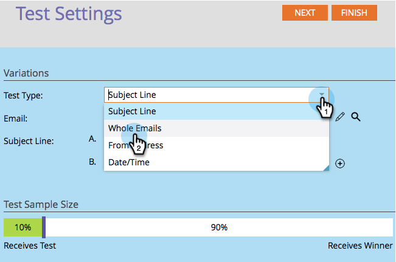

# Utiliser les tests A/B « E-mail complet » {#use-whole-email-a-b-testing}

Vous pouvez facilement tester A/B vos e-mails. Le test **E-mail complet** est un excellent test. Voici comment le configurer.

>[!PREREQUISITES]
>
>[Ajouter un test A/B](/help/marketo/product-docs/email-marketing/email-programs/email-program-actions/email-test-a-b-test/add-an-a-b-test.md)

1. Sous la mosaïque E-mail, une fois votre adresse e-mail sélectionnée, cliquez sur **[!UICONTROL Ajouter un test A/B]**.

1. Une nouvelle fenêtre s’ouvre. Cliquez sur le menu déroulant **[!UICONTROL Type de test]** et sélectionnez **[!UICONTROL E-mails complets]**.

   

1. Si vous disposez d’informations de test précédentes (comme un test du sujet), vous pouvez cliquer en toute sécurité sur **[!UICONTROL Réinitialiser le test]**.

   

1. Sélectionnez votre premier e-mail.

   

1. Cliquez sur **[!UICONTROL Ajouter]** pour appliquer l’e-mail.

   

   >[!TIP]
   >
   >Vous pouvez ajouter plusieurs e-mails. Cependant, si vous en ajoutez trop, cela peut ralentir considérablement le processus de test.

1. Sélectionnez votre deuxième adresse e-mail.

   

1. Cliquez sur **[!UICONTROL Ajouter]** pour appliquer le deuxième e-mail. Faites glisser le curseur pour choisir le pourcentage de l’audience qui doit recevoir votre test A/B, puis cliquez sur **[!UICONTROL Suivant]**.

   

   >[!NOTE]
   >
   >Les différentes variations sont envoyées à des parties égales de la **taille de l’échantillon de test** choisie.

   >[!CAUTION]
   >
   >**Nous vous recommandons d’éviter de définir la taille de l’échantillon sur 100 %**. Si vous utilisez une liste statique, la définition de la taille de l’échantillon sur 100 % envoie l’e-mail à tous les membres de l’audience et le gagnant n’est attribué à personne. Si vous utilisez une liste **intelligente**, la définition de la taille de l’échantillon sur 100 % envoie l’e-mail à toutes les personnes de l’audience _à ce moment-là_. Lorsque le programme de messagerie s’exécutera à nouveau à une date ultérieure, toutes les nouvelles personnes qui remplissent les critères de la liste dynamique recevront également le message électronique, car elles sont désormais incluses dans l’audience.

   On y est presque. Maintenant, nous devons [définir les critères de gagnant du test A/B](/help/marketo/product-docs/email-marketing/email-programs/email-program-actions/email-test-a-b-test/define-the-a-b-test-winner-criteria.md).
