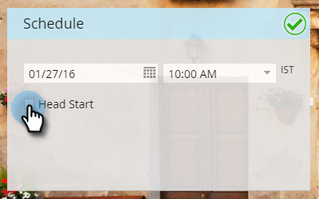

# Début principal pour les Programmes électroniques {#head-start-for-email-programs}

>[!NOTE]
>
>**Conditions préalables**
>
>* [Créer un Programme de messagerie](../../../../product-docs/email-marketing/email-programs/creating-an-email-program/create-an-email-program.md)

>

Lorsque vous choisissez une date/heure pour un Programme de courriel, il détermine à quel moment le programme commencera à se traiter. Si vous souhaitez que vos courriers électroniques soient lancés à l’heure sélectionnée, Head Début vous offre cette option en traitant le programme à l’avance.

## Début d&#39;en-tête standard {#standard-head-start}

1. Cliquez sur Activités **** marketing.

   

1. Recherchez et sélectionnez votre Programme de messagerie.

   

   >[!NOTE]
   >
   >Le Début d’en-tête ne peut pas être utilisé avec les tests A/B.

1. Dans le volet Planifier, planifiez votre courrier électronique, puis cochez la case **Début** d’en-tête.

   

   Le Début principal étant sélectionné, le programme commencera à traiter environ 12 heures avant l’heure prévue. Une fois les débuts de traitement traités, le programme est verrouillé.

   >[!CAUTION]
   >
   >Toute personne de votre audience qui se désabonne après le verrouillage du programme recevra toujours le courrier électronique. Nous vous recommandons de modifier votre notification de désabonnement afin de tenir compte du fait que le traitement des désabonnements peut prendre entre 1 et 2 jours ouvrables.

1. Cliquez sur **Approuver le Programme**.

   

   Après l’approbation du programme, vous pouvez afficher quatre états différents sur le volet Approbation.

   * **En attente d&#39;exécution :** Une fois le programme approuvé.
   * **Le traitement a démarré, en attente d&#39;exécution :** Le traitement est en cours.
   * **Traitement terminé, en attente d’exécution :** Traitement terminé, courrier électronique en attente de lancement planifié.
   * **Terminé :** Programme terminé.

   >[!TIP]
   >
   >Voulez-vous annuler après le verrouillage du programme mais avant l&#39;envoi du courriel ? Pas de problème ! Il vous suffit de cliquer sur **Abandonner le Programme** dans l’angle inférieur droit de la mosaïque Approbation.

   >[!NOTE]
   >
   >Si vous désapprouvez votre programme de messagerie avec moins de 12 heures avant son exécution planifiée, mais que vous changez d’avis, vous devez choisir une nouvelle date/heure qui est au moins 12 heures en avance par rapport à son approbation.

## Début de tête avec fuseau horaire Destinataire {#head-start-with-recipient-time-zone}

Notre fonction de Début-tête actuel exige que le programme soit programmé au moins 12 heures à l&#39;avance. Qu&#39;est-ce que cela signifie pour le fuseau horaire Destinataire ? Rappelez-vous que lorsque le fuseau horaire du Destinataire est principal, nous débuts à exécuter le programme électronique à minuit dans le fuseau horaire le plus proche (UTC +14:00). Ainsi, pour activer **à la fois** le fuseau horaire Début principal et le fuseau horaire Destinataire, les programmes doivent être programmés **au moins 12 heures avant le fuseau horaire le plus tôt (UTC +14:00**).

Cela signifie que si vous êtes en Amérique/Los Angeles et que vous souhaitez activer le fuseau horaire Début et Destinataire, vous devez programmer le programme **34 heures** à l&#39;avance. Comment en sommes-nous arrivés à ce chiffre ?

[En savoir plus](scheduling-with-recipient-time-zone/schedule-email-programs-with-recipient-time-zone.md) sur la planification des programmes de messagerie avec fuseau horaire Destinataire.

>[!NOTE]
>
>**Articles connexes**
>
>* [Planification de votre Programme de messagerie](schedule-your-email-program.md)
>* [Planification des Programmes de courriel avec fuseau horaire Destinataire](scheduling-with-recipient-time-zone/schedule-email-programs-with-recipient-time-zone.md)
>* [Présentation du fuseau horaire Destinataire](scheduling-with-recipient-time-zone/understanding-recipient-time-zone.md)

>

