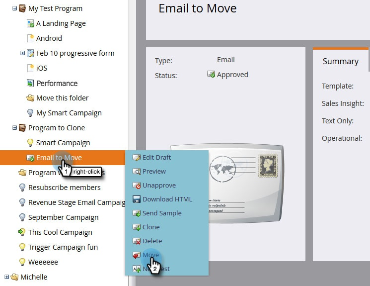

# Déplacer un courrier électronique {#move-an-email}

Vous devez déplacer un courriel d&#39;un programme à un autre ? Voici comment.

1. Accédez à Activités **** marketing.

   

1. Recherchez le courrier électronique à déplacer, cliquez dessus avec le bouton droit et sélectionnez **Déplacer**.

   

1. Cliquez sur la liste déroulante **Déplacer vers** et sélectionnez Activités **** marketing.

   

   >[!NOTE]
   >
   >Dans cet exemple, nous déplaçons un courrier électronique vers un autre programme, mais vous pouvez également déplacer un courrier électronique vers un dossier dans Design Studio.

1. Cliquez sur la liste déroulante **Programme** , recherchez et sélectionnez le programme de destination, puis cliquez sur **Déplacer**.

   

   Vous verrez que votre courriel vit maintenant dans l&#39;autre programme.

   

   Plutôt chouette !

