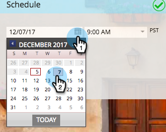

# Planification de votre programme de messagerie {#schedule-your-email-program}

>[!PREREQUISITES]
>
>* [Création d’un programme de courrier électronique](/help/marketo/product-docs/email-marketing/email-programs/creating-an-email-program/create-an-email-program.md)
>* [Définition d’une audience avec une liste dynamique](/help/marketo/product-docs/email-marketing/email-programs/managing-people-in-email-programs/define-an-audience-with-a-smart-list.md) ou [Définition d’une audience en important une liste](/help/marketo/product-docs/email-marketing/email-programs/managing-people-in-email-programs/define-an-audience-by-importing-a-list.md)
>
>* [Choisir un email existant](/help/marketo/product-docs/email-marketing/email-programs/email-program-actions/choose-an-existing-email.md) ou [Création d’un courrier électronique pour un programme de courrier électronique](/help/marketo/product-docs/email-marketing/email-programs/email-program-actions/create-an-email-for-an-email-program.md)

Une fois votre programme de messagerie créé, l’audience définie et l’email sélectionné, indiquez à votre programme *when* pour envoyer l’email. Voici comment.

1. Accédez à **Activités marketing**.

   

1. Sélectionnez votre programme de messagerie.

   

1. Sous , **Planification** , définissez la date.

   

1. Et puis le temps.

   

1. Vous pouvez également choisir d’utiliser la variable [Fuseau horaire du destinataire](/help/marketo/product-docs/email-marketing/email-programs/email-program-actions/scheduling-with-recipient-time-zone/schedule-email-programs-with-recipient-time-zone.md) et/ou [Début](/help/marketo/product-docs/email-marketing/email-programs/email-program-actions/head-start-for-email-programs.md) fonctions.

   

   C&#39;était facile ? La seule chose qui reste est de [approbation d’un programme de messagerie](/help/marketo/product-docs/email-marketing/email-programs/email-program-actions/approve-unapprove-an-email-program.md) et tu es bon d&#39;y aller.

>[!MORELIKETHIS]
>
>* [Planification des programmes de messagerie avec un fuseau horaire de destinataire](/help/marketo/product-docs/email-marketing/email-programs/email-program-actions/scheduling-with-recipient-time-zone/schedule-email-programs-with-recipient-time-zone.md)
>* [Prise en main des programmes de messagerie](/help/marketo/product-docs/email-marketing/email-programs/email-program-actions/head-start-for-email-programs.md)

